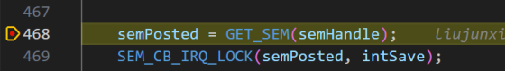
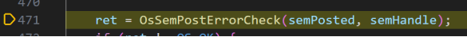
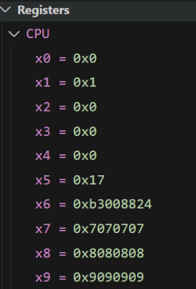
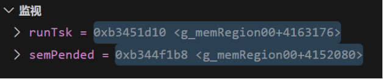
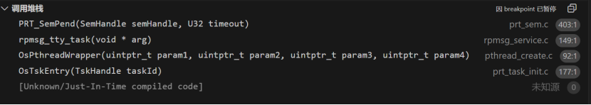

# UniProton vscode调试使用指南

## 1 vscode插件安装

当前使用vscode版本为1.101.0，安装vscode完成后，安装C/C++、C/C++ Extension Pack、GDB Debug插件。

## 2 vscode插件安装

1) 在UniProton工程所在编译环境上（WSL或服务器），安装gdb-multiarch，安装命令为sudo apt install gdb-multiarch，默认安装在/usr/bin目录下。

2) vscode打开UniProton工程，点击vscode左侧工具栏的运行和调试按钮，并继续点击创建launch.json文件。

3) launch.json文件设置如下：
```
{
  "version": "0.2.0",
  "configurations": [
    {
      "name": "Remote Debug",
      "type": "cppdbg",
      "request": "launch",
      "program": "/home/uniproton/UniProton/demos/hi3095/build/hi3095.elf", // 编译镜像所在路径
      "miDebuggerPath": "/usr/bin/gdb-multiarch",  // gdb-multiarch 安装路径
      "miDebuggerServerAddress": "192.168.0.11:5678",  // 测试单板ip地址与gdb监听端口，端口默认5678
      "cwd": "${workspaceFolder}",
      "stopAtEntry": true,
      "setupCommands": [
        {
          "description": "prettyprint",
          "text": "-enable-pretty-printing",
          "ignoreFailures": true
        }
      ]
    }
  ]
}
```

## 3 镜像编译部署

1) 以hi3095为例，修改配置文件build/uniproton_config/config_armv8_hi3095/defconfig，使能开关CONFIG_OS_GDB_STUB=y，编译生成镜像hi3095.elf。如使用docker编译时需注意，为保证gdb调试时文件编译路径与vscode打开路径一致，需将UniProton代码安装在WSL或服务器的/home/uniproton目录下（docker默认安装目录）。

2) 在测试单板上配置mica拉起的hi3095-uniproton-gdb.conf文件：
```
[Mica]
Name=uniproton-hi3095-gdb
CPU=3
ClientPath=/mcs/hi3095.elf
AutoBoot=no
Debug=yes
```
其中Debug=yes使能了mica的gdbserver，从而允许vscode远程gdb调试。

3) 将编译生成的hi3095.elf上传单板，并依次执行mica create hi3095-uniproton-gdb.conf和mica start uniproton-hi3095-gdb指令启动镜像，镜像启动完成后，便可在vscode上启动调试。

## 4 vscode调试验证

使用vscode debug功能调试UniProton代码，包含断点设置、单步调试、变量监视以及调用栈显示等功能

1) 断点设置



2) 单步调试




3) 变量查看


4) 寄存器查看



5) 变量监视



6) 调用栈显示

