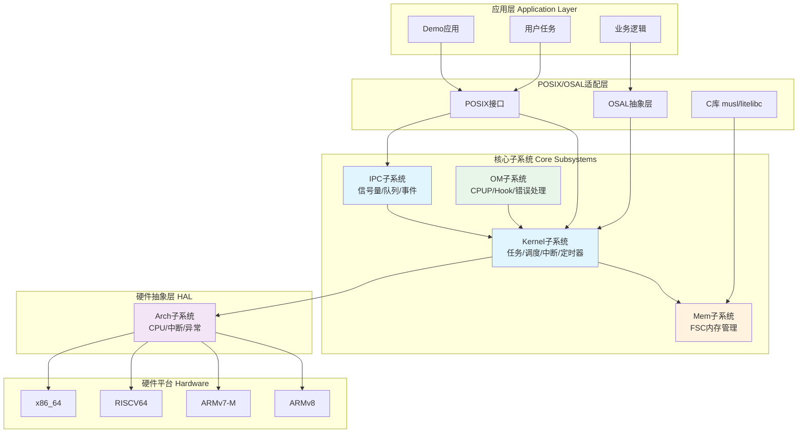
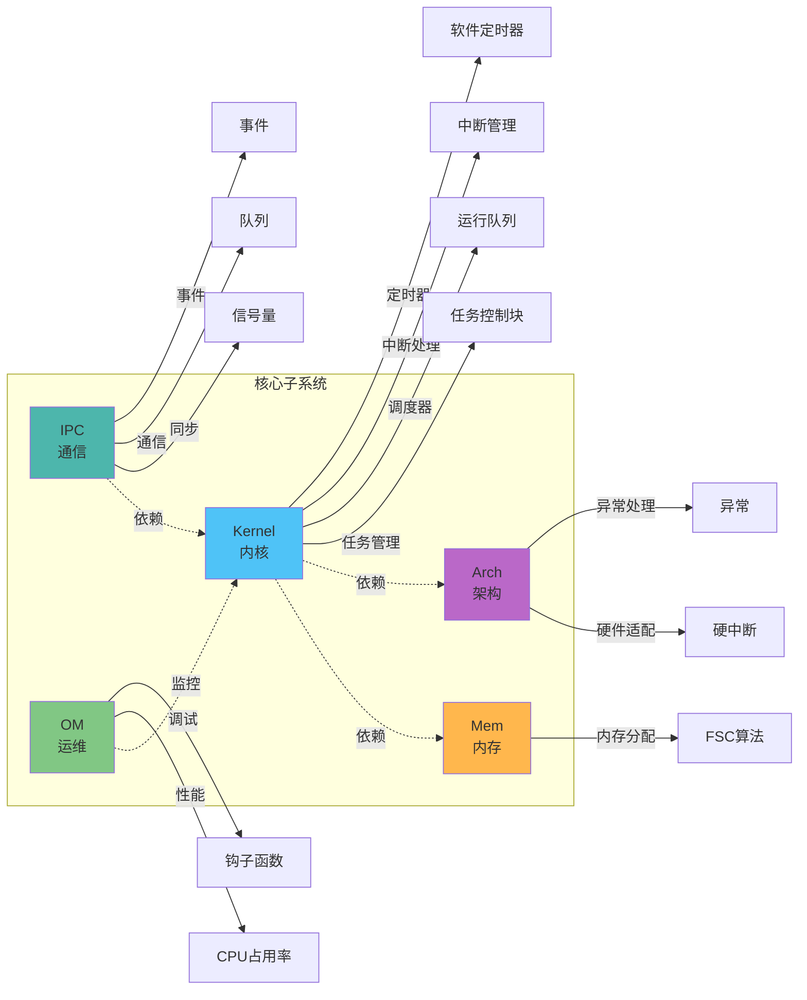

# UniProton RTOS 技术沙盘

> 本技术沙盘系统化梳理了UniProton实时操作系统的核心架构、关键模块和实现细节，为深入学习和开发提供全面的技术参考。

## 📚 项目概述

**UniProton** 是一款面向工业控制场景的实时操作系统(RTOS)，具备以下核心特性：

- ⚡ **极致低时延**：抢占式调度，支持高优先级任务快速响应
- 🎯 **混合关键性部署**：支持不同安全等级的任务混合部署
- 🔧 **灵活架构支持**：支持ARMv7-M、ARMv7-R、ARMv8、RISCV64、x86_64多种架构
- 🚀 **多核支持**：支持SMP和AMP两种多核模式
- 📦 **单进程多线程**：轻量级设计，适合嵌入式场景

**代码统计**：
- 核心代码：~15万行C/汇编代码
- 五大核心子系统：Kernel、Mem、Arch、IPC、OM
- 支持架构：5种主流架构
- 外部API：200+ 个接口函数

---

## 🏗️ 整体架构

### 系统架构分层图



### 五大核心子系统关系图



---

## 📖 核心子系统文档导航

### 1. Kernel子系统 - 内核核心

> **核心职责**：任务管理、调度、中断处理、定时器

- [📋 Kernel子系统概述](./kernel/README.md)
- [🎯 任务管理详解](./kernel/task.md) - 任务创建、控制块、状态转换
- [⚙️ 调度器实现](./kernel/scheduler.md) - 抢占式调度、运行队列、调度算法
- [⚡ 中断处理机制](./kernel/irq.md) - 硬中断管理、中断嵌套
- [⏰ TICK中断](./kernel/tick.md) - 系统时钟、TICK处理
- [⏱️ 软件定时器](./kernel/timer.md) - 定时器创建、超时处理

**关键文件位置**：
- 任务管理：`src/core/kernel/task/`
- 调度器：`src/core/kernel/sched/`
- 中断处理：`src/core/kernel/irq/`
- 定时器：`src/core/kernel/timer/swtmr/`

---

### 2. Mem子系统 - 内存管理

> **核心职责**：内存分区管理、FSC算法、内存申请释放

- [📋 Mem子系统概述](./mem/README.md)
- [🧩 内存管理总览](./mem/overview.md) - 内存分区、对齐策略
- [🚀 FSC算法详解](./mem/fsc.md) - Fast Size Class算法实现

**关键文件位置**：
- 主逻辑：`src/mem/prt_mem.c`
- FSC实现：`src/mem/fsc/prt_fscmem.c`

---

### 3. Arch子系统 - 硬件架构

> **核心职责**：CPU架构适配、硬中断、异常处理、上下文切换

- [📋 Arch子系统概述](./arch/README.md)
- [🎯 架构支持总览](./arch/overview.md) - 多架构支持、抽象设计
- [💪 ARMv8架构详解](./arch/armv8.md) - AArch64实现、GIC中断控制器
- [🔧 ARMv7-M架构详解](./arch/armv7-m.md) - Cortex-M4实现、NVIC
- [🔄 上下文切换机制](./arch/context-switch.md) - 任务切换、寄存器保存恢复

**关键文件位置**：
- ARMv8：`src/arch/cpu/armv8/`
- ARMv7-M：`src/arch/cpu/armv7-m/`
- 公共接口：`src/arch/include/`

---

### 4. IPC子系统 - 进程间通信

> **核心职责**：信号量、队列、事件、读写锁

- [📋 IPC子系统概述](./ipc/README.md)
- [🔒 信号量机制](./ipc/semaphore.md) - P/V操作、互斥信号量、优先级继承
- [📬 队列通信](./ipc/queue.md) - 消息队列、读写阻塞
- [🎪 事件机制](./ipc/event.md) - 事件标志组、等待模式
- [📖 读写锁](./ipc/rwlock.md) - 读写分离、并发控制

**关键文件位置**：
- 信号量：`src/core/ipc/sem/`
- 队列：`src/core/ipc/queue/`
- 事件：`src/core/ipc/event/`

---

### 5. OM子系统 - 运维调试

> **核心职责**：CPU占用率统计、钩子函数、错误处理

- [📋 OM子系统概述](./om/README.md)
- [📊 CPU占用率统计](./om/cpup.md) - CPUP计算、告警机制
- [🪝 钩子函数机制](./om/hook.md) - 任务切换钩子、中断钩子
- [⚠️ 错误处理机制](./om/error.md) - 错误码、错误记录

**关键文件位置**：
- CPUP：`src/om/cpup/`
- Hook：`src/om/hook/`
- Error：`src/om/err/`

---

## 🎓 学习路径建议

### 初学者路径 (1-2周)


**推荐阅读顺序**：
1. [整体架构](./architecture/overview.md) - 理解系统全貌
2. [任务管理](./kernel/task.md) - 掌握任务创建、状态转换
3. [调度器](./kernel/scheduler.md) - 理解抢占式调度原理
4. [信号量](./ipc/semaphore.md) - 学习任务同步机制
5. [内存管理](./mem/overview.md) - 了解内存分配机制

### 进阶开发者路径 (2-4周)

**推荐阅读顺序**：
1. [调度器实现细节](./kernel/scheduler.md) - 运行队列、调度类
2. [FSC算法](./mem/fsc.md) - 内存管理算法实现
3. [中断处理](./kernel/irq.md) + [异常处理](./arch/armv8.md) - 中断机制
4. [软件定时器](./kernel/timer.md) - 定时器排序链表
5. [上下文切换](./arch/context-switch.md) - 底层切换机制

### 架构专家路径 (4-8周)

**深入研究方向**：
1. **多核机制**：SMP调度、核间通信、任务迁移
2. **架构移植**：新架构适配、启动流程、异常向量表
3. **性能优化**：CPUP分析、调度延迟优化
4. **实时性分析**：中断延迟、任务响应时间

---

## 🔍 关键数据结构速查

| 数据结构 | 定义位置 | 说明 | 文档 |
|---------|---------|------|------|
| `struct TagTskCb` | `prt_task_external.h:106` | 任务控制块 | [任务管理](./kernel/task.md) |
| `struct TagOsRunQue` | `prt_sched_external.h:69` | 运行队列(SMP) | [调度器](./kernel/scheduler.md) |
| `struct TagFscMemCtrl` | `prt_mem_external.h:39` | FSC内存控制块 | [FSC算法](./mem/fsc.md) |
| `struct TagSemCb` | `prt_sem_external.h:87` | 信号量控制块 | [信号量](./ipc/semaphore.md) |
| `struct TagQueCb` | `prt_queue_external.h:61` | 队列控制块 | [队列](./ipc/queue.md) |
| `struct TagSwTmrCtrl` | `prt_swtmr_external.h:43` | 软件定时器控制块 | [定时器](./kernel/timer.md) |

---

## 🛠️ 核心API速查

### 任务管理
- `PRT_TaskCreate()` - 创建任务
- `PRT_TaskDelete()` - 删除任务
- `PRT_TaskSuspend()` / `PRT_TaskResume()` - 挂起/恢复任务
- `PRT_TaskDelay()` - 任务延时
- `PRT_TaskPrioritySet()` - 设置优先级

### 内存管理
- `PRT_MemAlloc()` - 申请内存
- `PRT_MemAllocAlign()` - 对齐申请内存
- `PRT_MemFree()` - 释放内存

### 信号量
- `PRT_SemCreate()` / `PRT_SemDelete()` - 创建/删除信号量
- `PRT_SemPend()` / `PRT_SemPost()` - P/V操作

### 队列
- `PRT_QueueCreate()` / `PRT_QueueDelete()` - 创建/删除队列
- `PRT_QueueRead()` / `PRT_QueueWrite()` - 读/写队列

### 中断
- `PRT_HwiCreate()` / `PRT_HwiDelete()` - 创建/删除硬中断
- `PRT_HwiEnable()` / `PRT_HwiDisable()` - 使能/禁用中断

---

## 📊 代码组织规范

### 命名规范
```c
// 外部API
U32 PRT_TaskCreate(TskHandle *taskPid, struct TskInitParam *initParam);

// 内部函数
void OsTskSchedule(void);

// 数据结构
struct TagTskCb { ... };

// 宏定义
#define OS_TSK_PRIORITY_HIGHEST  0

// 全局变量
extern struct TagOsRunQue g_runQueue[OS_MAX_CORE_NUM];
```

### 文件组织
```
模块目录/
├── prt_module.c              # 主逻辑
├── prt_module_init.c         # 初始化
├── prt_module_minor.c        # 次要功能
├── prt_module_internal.h     # 内部头文件
└── include/
    └── prt_module_external.h # 外部接口
```

---

## 🚀 快速开始

### 构建Demo应用
```bash
# 进入Docker环境
docker run -it -v $(pwd):/home/uniproton \
  swr.cn-north-4.myhuaweicloud.com/openeuler-embedded/uniproton:v004

# 构建ARMv8平台demo
cd demos/hi3093/build
sh build_app.sh

# 构建产物
# 静态库: demos/hi3093/libs/
# 二进制: demos/hi3093/build/
```

### 运行测试
```bash
cd testsuites/build
sh build_app.sh        # ARM测试
```

---

## 📚 相关资源

- **官方文档**：[UniProton用户指南](https://docs.openeuler.org/zh/docs/23.09/docs/Embedded/UniProton/)
- **接口手册**：[UniProton接口说明](https://docs.openeuler.org/zh/docs/23.09/docs/Embedded/UniProton/UniProton接口说明.html)
- **混合部署**：[MCS框架](https://gitee.com/openeuler/mcs)
- **源码仓库**：[Gitee - UniProton](https://gitee.com/openeuler/UniProton)

---

## 📝 文档更新记录

| 日期 | 版本 | 说明 |
|------|------|------|
| 2025-12-01 | v1.0 | 初始版本，完成五大核心子系统文档框架 |

---

**开始学习**：👉 [整体架构概述](./architecture/overview.md)
