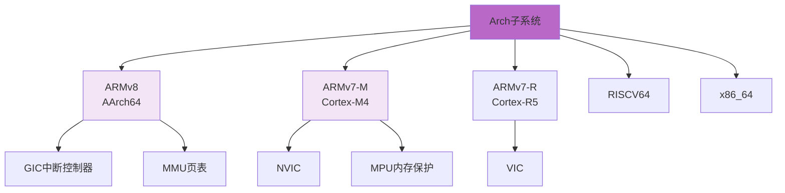
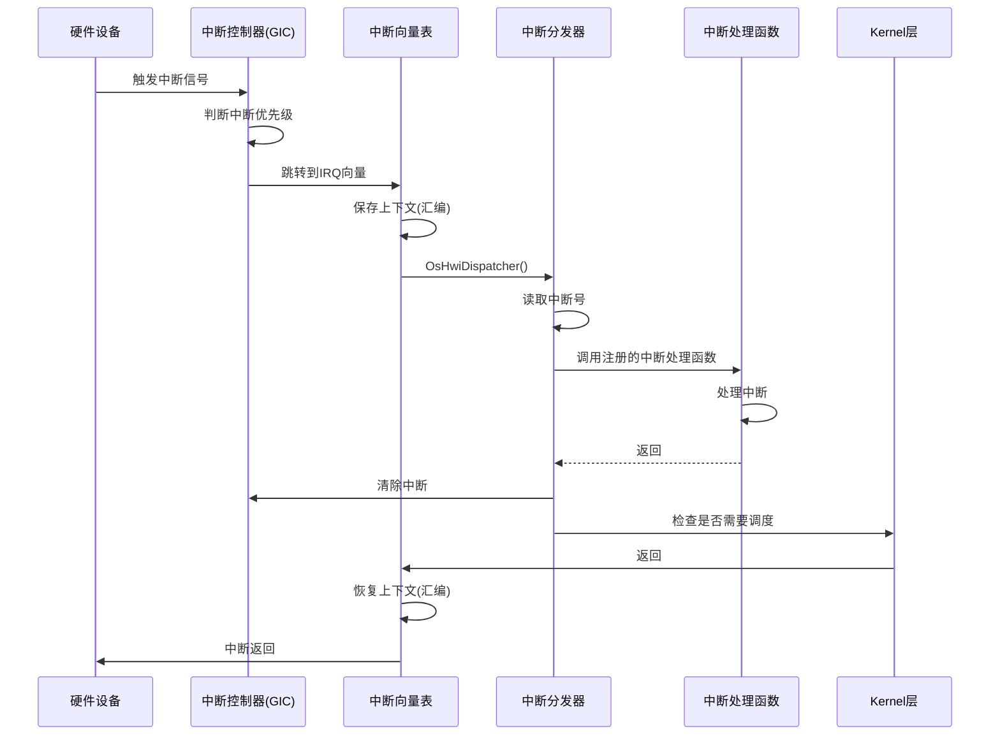

# Arch子系统概述

> Arch子系统提供硬件抽象层，屏蔽不同CPU架构的差异，实现硬中断、异常处理和上下文切换等底层功能。

## 📌 核心功能

### 职责范围

- ✅ **CPU架构适配**：ARMv8、ARMv7-M、RISCV64、x86_64
- ✅ **硬中断管理**：中断创建、使能/禁用、中断分发
- ✅ **异常处理**：异常向量表、异常信息保存、ESR解析
- ✅ **上下文切换**：寄存器保存/恢复、任务切换
- ✅ **启动初始化**：BSS初始化、栈初始化、MMU配置
- ✅ **Cache管理**：DCache/ICache操作

**代码位置**：`src/arch/`

---

## 支持的架构



---

## 模块组成

### ARMv8架构

```
src/arch/cpu/armv8/common/
├── boot/                         # 启动代码
│   ├── prt_hw_boot.c             # 硬件启动
│   └── prt_bss_init.c            # BSS段初始化
├── hwi/                          # 硬中断
│   ├── prt_hwi.c                 # 中断管理
│   ├── prt_dispatch.S            # 中断分发(汇编)
│   ├── prt_vector.S              # 中断向量表(汇编)
│   └── prt_reset_vector.S        # 复位向量
├── exc/                          # 异常处理
│   ├── prt_exc.c                 # 异常处理
│   ├── prt_exc_init.c            # 异常初始化
│   ├── prt_exc_internal.h        # 异常内部接口
│   └── prt_hw_exc.S              # 硬件异常(汇编)
├── cache/                        # Cache管理
│   └── prt_cache.S               # Cache操作(汇编)
├── stacktrace/                   # 栈回溯
│   └── prt_stacktrace.c          # 栈回溯实现
├── prt_port.c                    # 任务切换
└── os_cpu_armv8_external.h       # ARMv8对外接口
```

### ARMv7-M架构

```
src/arch/cpu/armv7-m/common/
├── boot/
│   └── prt_hw_boot.c
├── hwi/
│   ├── prt_hwi.c
│   └── prt_vi_dispatch.c         # 中断分发
├── exc/
│   ├── prt_exc.c
│   └── prt_exc_internal.h
├── tick/
│   ├── prt_hw_tick.c             # TICK中断
│   └── prt_hw_tick_minor.c
└── cortex-m4/
    ├── prt_dispatch.S            # 任务切换(汇编)
    ├── prt_hw.S                  # 硬件操作(汇编)
    ├── prt_hw_exc.S              # 异常处理(汇编)
    └── prt_vector.S              # 向量表(汇编)
```

---

## 核心数据结构

### 1. 异常ESR信息(ARMv8)

**定义位置**：`src/arch/cpu/armv8/common/exc/prt_exc_internal.h:55`

```c
union TagExcEsr {
    struct {
        uintptr_t iss  : 25;  // 指令特定综合字段
        uintptr_t il   : 1;   // 指令长度位
        uintptr_t ec   : 6;   // 异常类别
        uintptr_t res0 : 32;
    } bits;
    uintptr_t esr;
};
```

**异常类别(EC)**：
- 0x00: Unknown reason
- 0x01: Trapped WFI/WFE
- 0x07: Access to SVE/SIMD
- 0x15: SVC instruction
- 0x20: Instruction abort (lower EL)
- 0x21: Instruction abort (same EL)
- 0x24: Data abort (lower EL)
- 0x25: Data abort (same EL)

### 2. 寄存器上下文(ARMv8)

```c
struct TskContext {
    uintptr_t x0;      // 通用寄存器x0-x30
    uintptr_t x1;
    // ...
    uintptr_t x30;     // LR(链接寄存器)
    uintptr_t elr;     // ELR_ELx(异常链接寄存器)
    uintptr_t spsr;    // SPSR_ELx(保存的程序状态寄存器)
    uintptr_t sp;      // SP(栈指针)
};
```

---

## 关键功能实现

### 1. 中断处理流程



### 2. 上下文切换

**关键函数**：`OsContextSwitch(prev, next)` - `prt_port.c`

```armasm
// 伪代码示例(ARMv8)
OsContextSwitch:
    // 保存prev任务上下文
    STP     x0, x1, [sp, #-16]!   // 保存x0,x1
    STP     x2, x3, [sp, #-16]!   // 保存x2,x3
    ...                            // 保存其他寄存器
    MRS     x0, ELR_EL1            // 保存异常返回地址
    MRS     x1, SPSR_EL1           // 保存状态寄存器
    STP     x0, x1, [sp, #-16]!

    // 保存prev->stackPointer
    MOV     x0, sp
    STR     x0, [prev_tcb, #0]    // prev->stackPointer = sp

    // 恢复next任务上下文
    LDR     x0, [next_tcb, #0]    // sp = next->stackPointer
    MOV     sp, x0

    LDP     x0, x1, [sp], #16     // 恢复ELR/SPSR
    MSR     ELR_EL1, x0
    MSR     SPSR_EL1, x1
    ...                            // 恢复其他寄存器
    LDP     x0, x1, [sp], #16     // 恢复x0,x1

    ERET                           // 异常返回
```

### 3. 异常处理

#### 异常向量表(ARMv8)

```
异常向量表基地址(VBAR_EL1)：
┌─────────────────────────────────┐ +0x000
│ Synchronous (Current EL, SP0)   │
├─────────────────────────────────┤ +0x080
│ IRQ/vIRQ (Current EL, SP0)      │
├─────────────────────────────────┤ +0x100
│ FIQ/vFIQ (Current EL, SP0)      │
├─────────────────────────────────┤ +0x180
│ SError/vSError (Current EL, SP0)│
├─────────────────────────────────┤ +0x200
│ Synchronous (Current EL, SPx)   │
├─────────────────────────────────┤ +0x280
│ IRQ/vIRQ (Current EL, SPx)      │
├─────────────────────────────────┤ +0x300
│ FIQ/vFIQ (Current EL, SPx)      │
├─────────────────────────────────┤ +0x380
│ SError/vSError (Current EL, SPx)│
├─────────────────────────────────┤ +0x400
│ Synchronous (Lower EL, AArch64) │
├─────────────────────────────────┤ +0x480
│ IRQ/vIRQ (Lower EL, AArch64)    │
└─────────────────────────────────┘
```

#### 异常信息保存

```c
struct ExcInfo {
    U32 excType;           // 异常类型
    U32 faultAddr;         // 异常地址
    U32 esr;               // ESR寄存器值
    struct TskContext context; // 寄存器上下文
};
```

---

## 主要API

### 硬中断API

```c
// 创建硬中断
U32 PRT_HwiCreate(HwiNum hwiNum, HwiPrior hwiPrio, HwiMode mode,
                  HwiProcFunc handler, HwiArg arg);

// 删除硬中断
U32 PRT_HwiDelete(HwiNum hwiNum);

// 使能/禁用中断
U32 PRT_HwiEnable(HwiNum hwiNum);
U32 PRT_HwiDisable(HwiNum hwiNum);

// 设置中断优先级
U32 PRT_HwiSetPriority(HwiNum hwiNum, HwiPrior priority);
```

### CPU操作API

```c
// 中断锁
U32 PRT_IntLock(void);
void PRT_IntRestore(U32 intSave);

// Cache操作
void PRT_CacheFlush(void);
void PRT_CacheInvalidate(void);

// CPU信息
U32 PRT_GetCoreID(void);
```

---

## 学习要点

### 1. 异常级别(Exception Level)

ARMv8有4个异常级别：
```
EL3 - Secure Monitor(最高特权级)
EL2 - Hypervisor
EL1 - OS Kernel        ← UniProton运行在这里
EL0 - User Application
```

### 2. 中断类型

| 类型 | 说明 | 优先级 |
|------|------|-------|
| Reset | 复位 | 最高 |
| FIQ | 快速中断请求 | 高 |
| IRQ | 普通中断请求 | 中 |
| SError | 系统错误 | 低 |
| Synchronous | 同步异常(如数据访问异常) | - |

### 3. GIC中断控制器

**组件**：
- **Distributor**：中断分发，设置优先级、目标CPU
- **CPU Interface**：每个CPU的中断接口
- **Redistributor**：SGI/PPI的分发(GICv3)

### 4. 上下文切换开销

**ARMv8上下文切换时间**：
- 保存/恢复寄存器：~30个寄存器 × 2条指令 ≈ 60条指令
- Cache影响：TLB刷新、数据Cache miss
- 总延迟：< 1μs (1GHz CPU)

---

## 详细文档

- **[架构支持总览](./overview.md)** - 多架构支持、抽象设计
- **[ARMv8架构详解](./armv8.md)** - AArch64实现、GIC中断控制器
- **[ARMv7-M架构详解](./armv7-m.md)** - Cortex-M4实现、NVIC
- **[上下文切换机制](./context-switch.md)** - 任务切换、寄存器保存恢复

---

[返回主目录](../README.md)
