# UniProton整体架构概述

> 本文深入分析UniProton RTOS的整体架构设计、核心设计理念和系统特性。

## 📌 目录

1. [系统定位与特性](#系统定位与特性)
2. [架构分层设计](#架构分层设计)
3. [五大核心子系统](#五大核心子系统)
4. [关键设计特点](#关键设计特点)
5. [代码组织结构](#代码组织结构)
6. [学习要点](#学习要点)

---

## 系统定位与特性

### 核心定位

UniProton是一款**面向工业控制场景**的实时操作系统(RTOS)，专注于：

- **极致低时延**：微秒级任务切换和中断响应
- **混合关键性部署**：在同一系统中运行不同安全等级的任务
- **多架构支持**：统一代码框架，支持多种CPU架构
- **单进程多线程**：轻量级设计，资源占用小

### 核心特性对比

| 特性 | UniProton | 通用RTOS | Linux |
|------|-----------|---------|-------|
| 任务切换时延 | < 1μs | 1-10μs | 10-100μs |
| 中断响应时延 | < 0.5μs | 1-5μs | 5-50μs |
| 内存占用 | < 100KB | 100-500KB | > 10MB |
| 实时性 | 硬实时 | 软/硬实时 | 非实时 |
| 多核支持 | SMP/AMP | 部分支持 | SMP |
| POSIX兼容 | 部分 | 部分 | 完整 |

### 支持的硬件平台

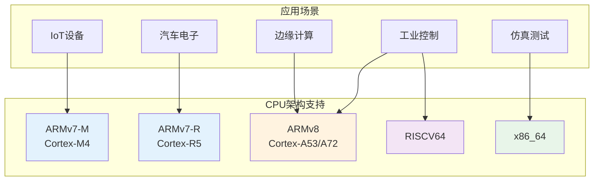

---

## 架构分层设计

### 整体分层架构

UniProton采用经典的分层设计，从下到上分为5层：

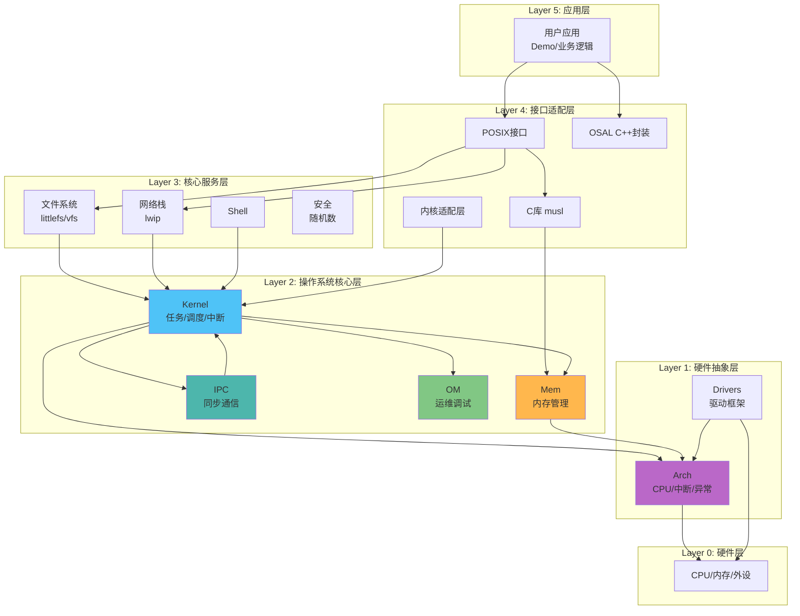

### 各层职责说明

#### Layer 5: 应用层
- **职责**：业务逻辑实现
- **典型代码**：`demos/*/apps/`
- **接口**：调用POSIX或UniProton原生API

#### Layer 4: 接口适配层
- **POSIX适配**：`src/kal/` - pthread、socket等接口
- **C库支持**：`src/libc/` - musl 1.2.3 + litelibc适配
- **OSAL**：`src/osal/` - C++封装、Linux接口模拟

#### Layer 3: 核心服务层
- **文件系统**：`src/fs/` - littlefs、VFS
- **网络栈**：`src/net/` - lwip适配
- **Shell**：`src/shell/` - 命令行支持
- **安全**：`src/security/` - 随机数生成

#### Layer 2: OS核心层（五大子系统）
- **Kernel**：`src/core/kernel/` - 任务、调度、中断、定时器
- **IPC**：`src/core/ipc/` - 信号量、队列、事件
- **Mem**：`src/mem/` - FSC内存管理
- **OM**：`src/om/` - CPUP、Hook、错误处理
- **Arch依赖**：依赖Arch层提供的硬件抽象

#### Layer 1: 硬件抽象层
- **Arch**：`src/arch/` - CPU架构适配
- **Drivers**：`src/drivers/` - 驱动框架

---

## 五大核心子系统

### 1. Kernel子系统 - 操作系统内核

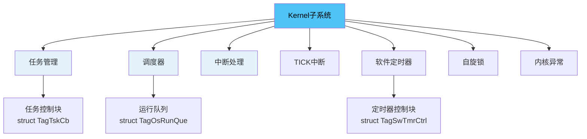

**核心功能**：
- **任务管理**：创建、删除、挂起、恢复、优先级管理
- **调度器**：抢占式调度、优先级调度、SMP/AMP支持
- **中断管理**：硬中断创建、使能/禁用、中断嵌套
- **定时器**：软件定时器、超时处理、定时器排序链表

**详细文档**：[Kernel子系统](../kernel/README.md)

### 2. Mem子系统 - 内存管理

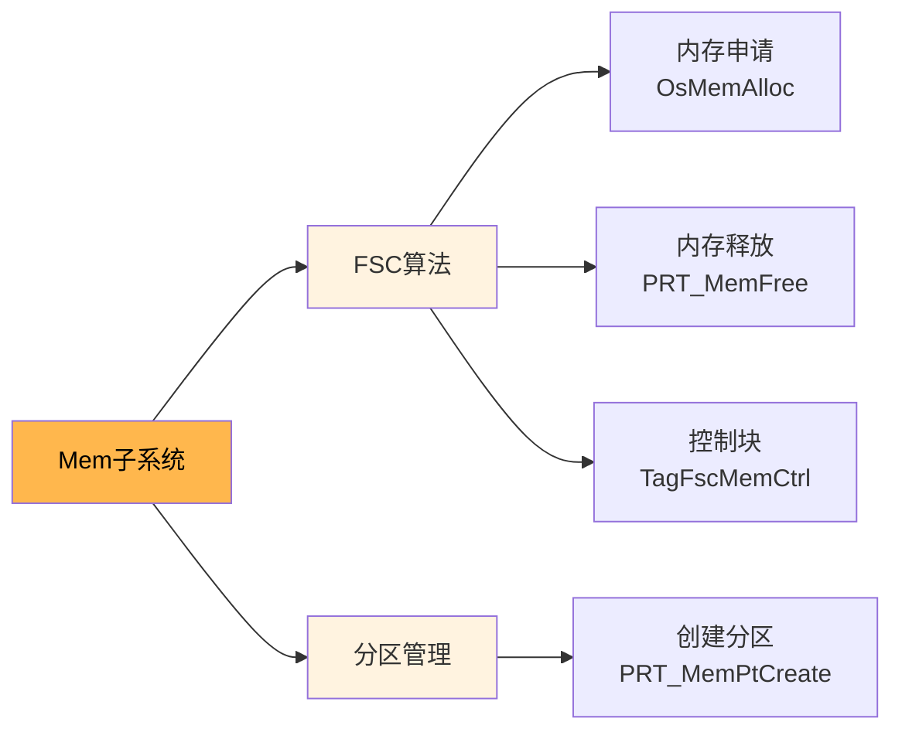

**核心功能**：
- **FSC算法**：Fast Size Class，快速内存分配
- **分区管理**：支持多个独立内存分区
- **对齐支持**：4字节对齐、自定义对齐

**详细文档**：[Mem子系统](../mem/README.md)

### 3. Arch子系统 - 硬件抽象

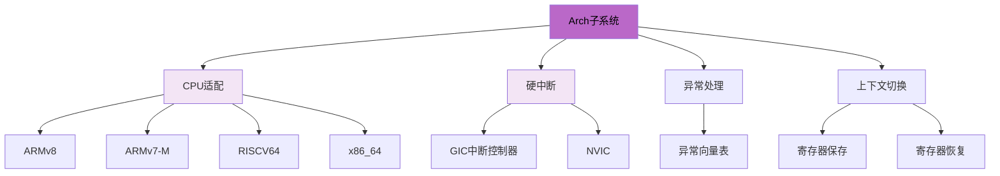

**核心功能**：
- **多架构支持**：ARMv8、ARMv7-M/R、RISCV64、x86_64
- **中断控制器**：GIC(ARMv8)、NVIC(ARMv7-M)
- **异常处理**：异常向量表、ESR解析、异常信息保存
- **上下文切换**：任务切换、寄存器保存恢复

**详细文档**：[Arch子系统](../arch/README.md)

### 4. IPC子系统 - 进程间通信

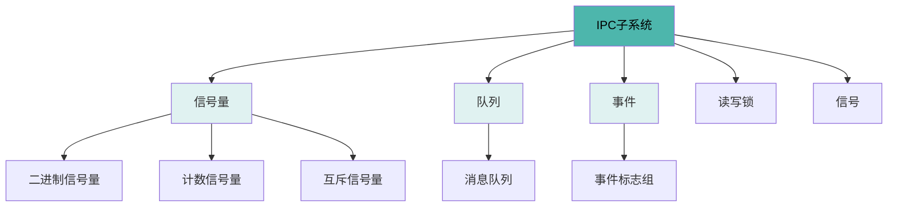

**核心功能**：
- **信号量**：P/V操作、优先级继承、递归P/V
- **队列**：消息队列、读写阻塞、超时机制
- **事件**：事件标志组、ANY/ALL模式、等待/非等待
- **读写锁**：读写分离、并发控制

**详细文档**：[IPC子系统](../ipc/README.md)

### 5. OM子系统 - 运维调试

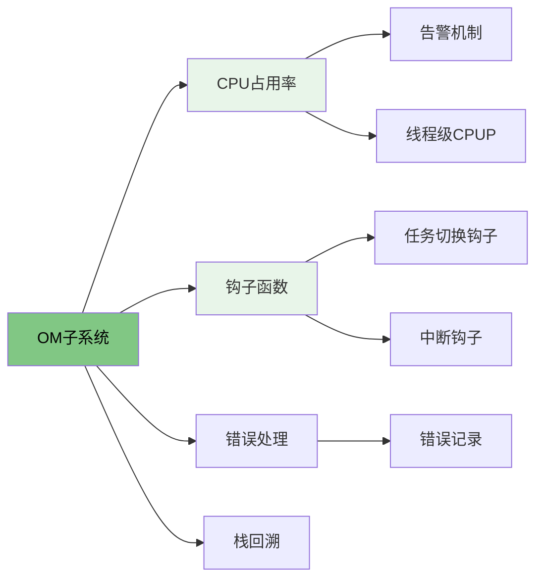

**核心功能**：
- **CPUP**：CPU占用率统计、告警阈值、线程级统计
- **Hook**：任务切换钩子、中断钩子、内存钩子、IDLE钩子
- **错误处理**：错误记录、错误码管理
- **栈回溯**：调用栈分析

**详细文档**：[OM子系统](../om/README.md)

---

## 关键设计特点

### 1. 抢占式调度机制

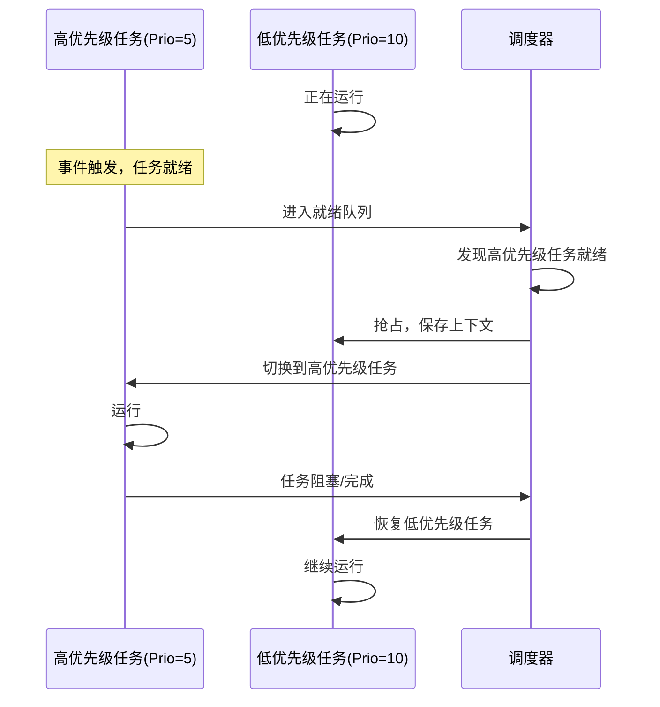

**特点**：
- 优先级范围：0-31（数字越小优先级越高）
- 高优先级任务可立即抢占低优先级任务
- 中断可抢占任务，高优先级中断可抢占低优先级中断
- 不使用时间片轮转（可选支持RR调度）

### 2. 多核支持架构

#### SMP模式（对称多处理）

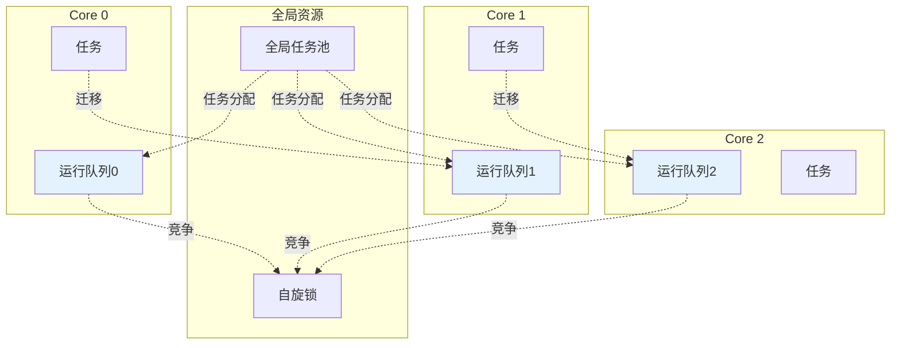

**SMP特点**：
- 每个核有独立运行队列
- 任务可在核间迁移
- 使用自旋锁保护共享资源
- 支持核亲和性设置

#### AMP模式（非对称多处理）

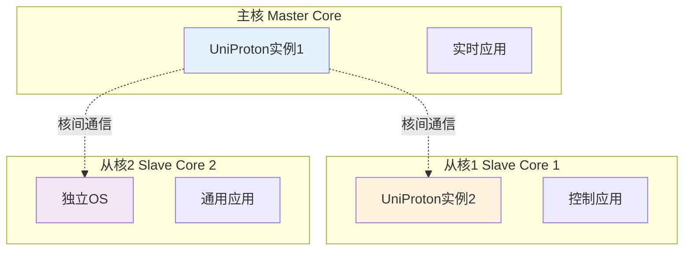

**AMP特点**：
- 每个核运行独立OS实例
- 核间通过共享内存通信
- 支持混合部署（UniProton + Linux）
- 适合混合关键性场景

### 3. FSC内存管理算法

**Fast Size Class算法**：

```
内存块大小分类：
- 小块: 8-256字节，8字节递增，共31个size class
- 中块: 256-2KB，16字节递增
- 大块: 2KB以上，使用首次适配

空闲链表组织：
┌─────────────────────────────────────┐
│ 位图(Bitmap)：标记哪些size class有空闲块 │
└─────────────────────────────────────┘
         ↓
┌─────────────────────────────────────┐
│ 空闲链表数组：每个size class一个链表    │
│ [0]: 8字节块链表                     │
│ [1]: 16字节块链表                    │
│ [2]: 24字节块链表                    │
│ ...                                 │
└─────────────────────────────────────┘
```

**优势**：
- O(1)时间复杂度分配/释放
- 内存碎片小
- 魔术字保护，检测内存越界

**详细分析**：[FSC算法详解](../mem/fsc.md)

### 4. 中断处理机制

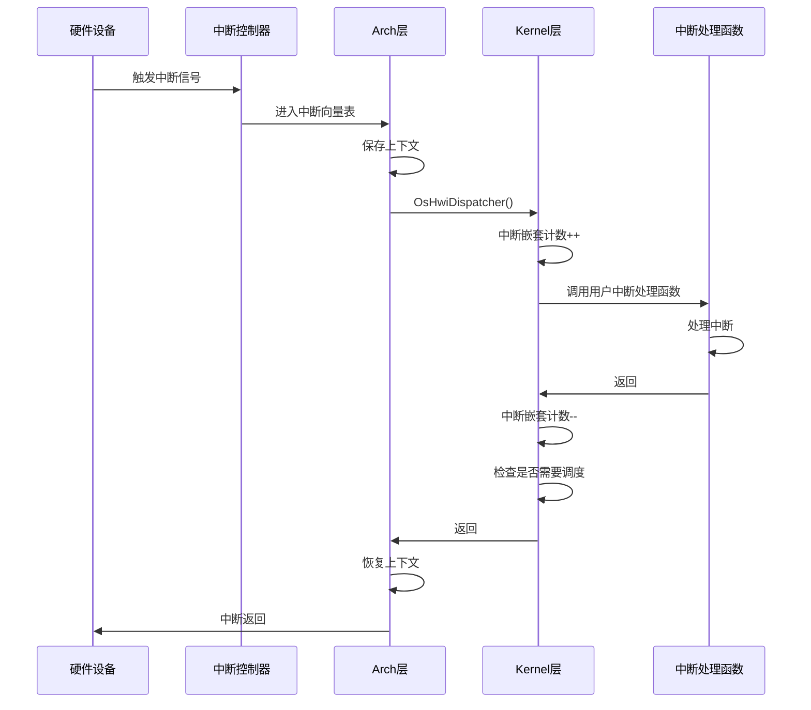

**中断嵌套支持**：
- 支持中断嵌套（可配置）
- 中断优先级管理
- 中断嵌套计数器

---

## 代码组织结构

### 源码目录结构

```
UniProton/
├── src/                           # 源代码
│   ├── core/                      # 核心子系统
│   │   ├── kernel/                # Kernel: 任务/调度/中断/定时器
│   │   └── ipc/                   # IPC: 信号量/队列/事件
│   ├── mem/                       # Mem: 内存管理
│   ├── arch/                      # Arch: 硬件适配
│   ├── om/                        # OM: 运维调试
│   ├── fs/                        # 文件系统
│   ├── net/                       # 网络栈
│   ├── libc/                      # C库支持
│   ├── kal/                       # POSIX适配
│   ├── osal/                      # 操作系统抽象层
│   ├── drivers/                   # 驱动框架
│   ├── security/                  # 安全功能
│   ├── shell/                     # Shell
│   └── include/                   # 公共头文件
│       └── uapi/                  # 用户API头文件
├── build/                         # 构建配置
│   └── uniproton_config/          # 各平台配置
│       ├── config_armv8/          # ARMv8配置
│       ├── config_armv7-m/        # ARMv7-M配置
│       └── ...
├── demos/                         # 示例应用
│   ├── hi3093/                    # Hi3093平台(ARMv8)
│   ├── raspi4/                    # 树莓派4
│   ├── m4/                        # Cortex-M4
│   └── x86_64/                    # x86_64
├── cmake/                         # CMake构建脚本
├── platform/                      # 平台相关
│   └── libboundscheck/            # 边界检查库
├── testsuites/                    # 测试套件
└── doc/                           # 设计文档
    └── design/                    # 功能设计文档
```

### 代码文件命名规范

#### 模块前缀
```
prt_           # UniProton模块
os_            # 操作系统通用
tag_           # 数据结构标签
```

#### 文件类型
```
prt_module.c              # 主逻辑实现
prt_module_init.c         # 初始化代码
prt_module_minor.c        # 次要功能
prt_module_internal.h     # 内部接口（模块内部使用）
prt_module_external.h     # 外部接口（模块间使用）
```

#### API命名
```c
// 外部API：PRT_<Module><Function>
U32 PRT_TaskCreate(TskHandle *taskPid, struct TskInitParam *initParam);
U32 PRT_SemCreate(U32 count, SemHandle *semHandle);

// 内部函数：Os<Module><Function>
void OsTskSchedule(void);
U32 OsMemAlloc(U32 mid, U32 size, void **addr);
```

#### 数据结构命名
```c
// 结构体：struct Tag<Name>
struct TagTskCb { ... };          // 任务控制块
struct TagOsRunQue { ... };       // 运行队列

// 枚举：enum <Name>
enum SemMode { ... };

// 宏：OS_<MODULE>_<NAME>
#define OS_TSK_PRIORITY_HIGHEST  0
#define OS_MEM_ALIGN_SIZE        4
```

### 条件编译机制

UniProton使用条件编译实现功能裁剪：

```c
// SMP多核支持
#if defined(OS_OPTION_SMP)
    volatile uintptr_t spinLock;
    U32 coreID;
#endif

// POSIX支持
#if defined(OS_OPTION_POSIX)
    char name[MAX_POSIX_SEMAPHORE_NAME_LEN + 1];
    sem_t handle;
#endif

// 信号量递归P/V
#if defined(OS_OPTION_SEM_RECUR_PV)
    U32 recurCount;
#endif
```

**配置文件位置**：
- `build/uniproton_config/config_<arch>/prt_buildef.h` - 功能宏定义
- `demos/<platform>/config/prt_config.h` - 用户配置

---

## 学习要点

### 核心概念理解

#### 1. 任务状态转换

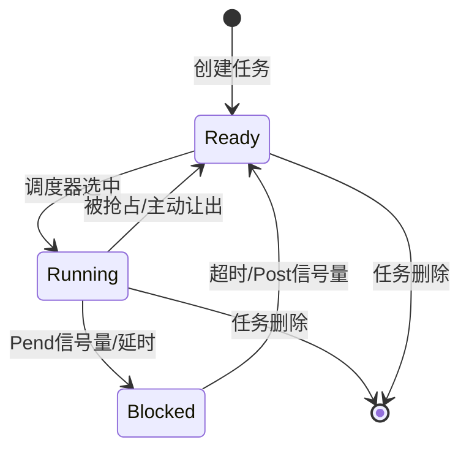

#### 2. 调度时机

任务调度发生在以下时机：
1. **主动调度**：任务调用延时、Pend等阻塞API
2. **被动调度**：高优先级任务就绪，抢占当前任务
3. **中断返回**：中断处理完成，检查是否有高优先级任务就绪
4. **TICK中断**：定时器超时，唤醒延时任务

#### 3. 优先级继承

防止优先级翻转的机制：

```
场景：
- 低优先级任务L持有互斥信号量M
- 高优先级任务H尝试获取M，被阻塞
- 中优先级任务M就绪，抢占L运行

优先级继承：
- 当H被L阻塞时，L的优先级临时提升到H的优先级
- L完成临界区，释放M后，优先级恢复
- 这样可以防止M长时间抢占L，导致H无法运行
```

### 关键数据结构掌握

必须掌握的核心数据结构：

1. **任务控制块** `struct TagTskCb` - 任务的所有信息
2. **运行队列** `struct TagOsRunQue` - 调度器核心
3. **信号量控制块** `struct TagSemCb` - 同步机制
4. **内存控制块** `struct TagFscMemCtrl` - 内存管理

### 代码阅读路线

**推荐阅读顺序**：

```
第1周：基础理解
1. src/core/kernel/task/amp/prt_task_init.c - 任务创建流程
2. src/core/kernel/sched/prt_sched.c - 调度器主逻辑
3. src/core/ipc/sem/prt_sem.c - 信号量P/V操作

第2周：深入机制
4. src/core/kernel/sched/prt_rt_single.c - 实时调度实现
5. src/mem/fsc/prt_fscmem.c - FSC内存分配算法
6. src/core/kernel/timer/swtmr/prt_swtmr.c - 软件定时器

第3周：底层实现
7. src/arch/cpu/armv8/common/hwi/prt_dispatch.S - 中断分发（汇编）
8. src/arch/cpu/armv8/common/exc/prt_exc.c - 异常处理
9. src/arch/cpu/armv8/common/prt_port.c - 上下文切换

第4周：高级特性
10. src/core/kernel/sched/prt_sched_class.c - 调度类（SMP）
11. src/om/cpup/prt_cpup.c - CPU占用率统计
12. demos/hi3093/bsp/ - BSP板级支持包
```

### 调试技巧

#### 1. 使用Hook钩子

```c
// 注册任务切换钩子
void MyTaskSwitchHook(U32 lastTaskPID, U32 nextTaskPID) {
    printf("Task switch: %u -> %u\n", lastTaskPID, nextTaskPID);
}

PRT_HookAdd(OS_HOOK_TSK_SWITCH, MyTaskSwitchHook);
```

#### 2. CPUP性能分析

```c
// 获取线程CPU占用率
U32 usage;
PRT_CpupThread(taskPid, &usage);
printf("Task %u CPU usage: %u.%02u%%\n", taskPid, usage/100, usage%100);
```

#### 3. 栈回溯

```c
// 使能栈回溯
struct UnwindConfig cfg = {
    .uwType = OS_UNWIND_TYPE_ALL,
};
PRT_UnwindInit(&cfg);

// 获取调用栈
void *backtrace[10];
int depth = PRT_Unwind(backtrace, 10);
```

---

## 下一步学习

选择一个核心子系统开始深入学习：

- [Kernel子系统 - 任务管理和调度](../kernel/README.md)
- [Mem子系统 - FSC内存管理](../mem/README.md)
- [Arch子系统 - 硬件抽象](../arch/README.md)
- [IPC子系统 - 进程间通信](../ipc/README.md)
- [OM子系统 - 运维调试](../om/README.md)

---

[返回主目录](../README.md)
