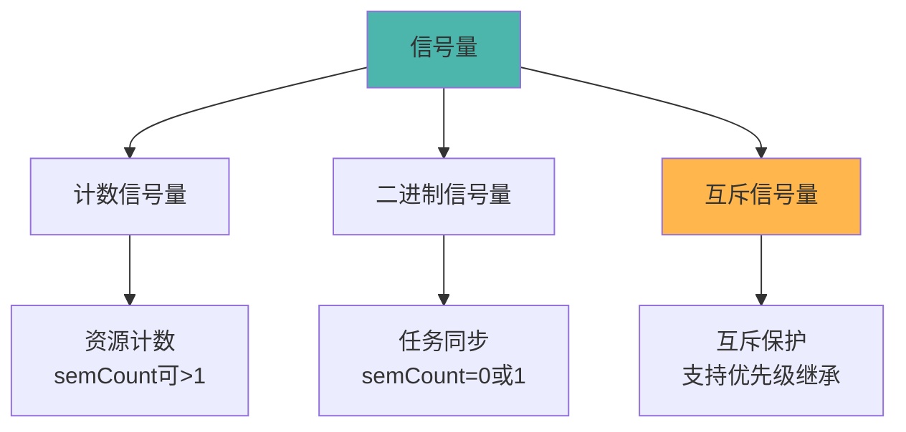
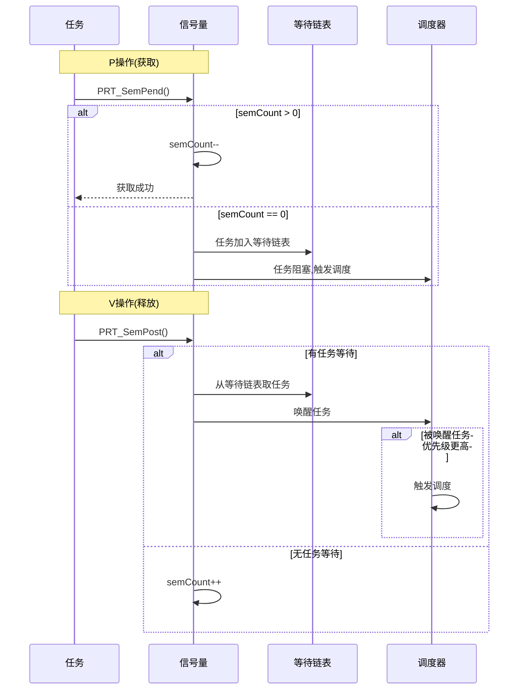
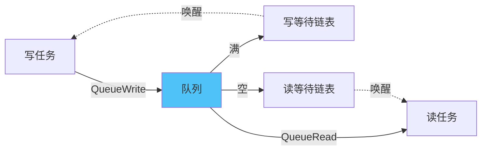

# IPC子系统概述

> IPC(Inter-Process Communication)子系统提供任务间通信和同步机制，包括信号量、队列、事件、读写锁等。

## 📌 核心功能

### 职责范围

- ✅ **信号量**：任务同步、互斥访问、资源计数
- ✅ **队列**：任务间消息传递、异步通信
- ✅ **事件**：事件标志组、多条件等待
- ✅ **读写锁**：读写分离、并发控制
- ✅ **信号**：POSIX信号支持

**代码位置**：`src/core/ipc/`

---

## 模块组成

```
src/core/ipc/
├── include/                      # 公共头文件
│   ├── prt_sem_external.h        # 信号量接口
│   ├── prt_queue_external.h      # 队列接口
│   └── prt_signal_external.h     # 信号接口
├── sem/                          # 信号量
│   ├── prt_sem.c                 # P/V操作
│   ├── prt_sem_init.c            # 创建/删除
│   └── prt_sem_minor.c           # 次要功能
├── queue/                        # 队列
│   ├── prt_queue.c               # 读写操作
│   ├── prt_queue_init.c          # 创建/删除
│   ├── prt_queue_del.c           # 删除逻辑
│   └── prt_queue_minor.c         # 次要功能
├── event/                        # 事件
│   └── prt_event.c               # 事件读写
├── rwlock/                       # 读写锁
│   ├── prt_rwlock.c              # 读写锁实现
│   └── prt_rwlock_internal.h     # 内部接口
└── signal/                       # 信号
    └── prt_signal.c              # 信号处理
```

---

## 核心数据结构

### 1. 信号量控制块

**定义位置**：`src/core/ipc/include/prt_sem_external.h:87`

```c
struct TagSemCb {
#if defined(OS_OPTION_SMP)
    volatile uintptr_t semLock;      // 信号量锁(SMP)
#endif
    U16 semStat;                      // 是否使用
    U16 semId;                        // 核内信号量索引号
    U32 semCount;                     // 信号量计数
    struct TagListObject semList;     // 阻塞任务链表
    struct TagListObject semBList;    // 持有互斥信号量链表
    U32 semOwner;                     // Pend到该信号量的线程ID
    enum SemMode semMode;             // 唤醒阻塞任务方式(FIFO/PRIO)
    U32 semType;                      // 信号量类型(计数/二进制/互斥)
};
```

### 2. 队列控制块

**定义位置**：`src/core/ipc/include/prt_queue_external.h:61`

```c
struct TagQueCb {
#if defined(OS_OPTION_SMP)
    uintptr_t queueLock;              // 队列锁(SMP)
#endif
    U8 *queue;                        // 队列起始地址
    U16 queueState;                   // 队列状态
    U16 nodeNum;                      // 队列长度(节点个数)
    U16 nodeSize;                     // 每个节点长度(word)
    U16 queueHead;                    // 当前队列头下标
    U16 queueTail;                    // 当前队列尾下标
    U16 nodePeak;                     // 队列节点使用峰值
    U16 writableCnt;                  // 写资源计数器
    U16 readableCnt;                  // 读资源计数器
    struct TagListObject writeList;   // 写队列超时LIST
    struct TagListObject readList;    // 读队列超时LIST
};
```

---

## 功能详解

### 1. 信号量机制

#### 信号量类型



#### P/V操作流程



### 2. 队列机制

#### 队列结构

```
环形队列：
┌─────┬─────┬─────┬─────┬─────┬─────┐
│  0  │  1  │  2  │  3  │  4  │  5  │
└─────┴─────┴─────┴─────┴─────┴─────┘
  ↑                       ↑
  head                    tail

写入：tail++
读取：head++
满：(tail+1) % nodeNum == head
空：tail == head
```

#### 读写流程



### 3. 事件机制

#### 事件标志组

```c
// 事件模式
#define OS_EVENT_ANY        0x00000001  // 任意事件满足
#define OS_EVENT_ALL        0x00000010  // 所有事件满足
#define OS_EVENT_WAIT       0x00010000  // 等待接收
#define OS_EVENT_NOWAIT     0x00100000  // 不等待接收
```

#### 使用示例

```c
// 等待事件
U32 events = 0;
PRT_EventRead(0x03,  // 等待bit0和bit1
              OS_EVENT_ALL | OS_EVENT_WAIT,
              &events);

// 设置事件
PRT_EventWrite(taskPid, 0x01);  // 设置bit0
```

---

## 主要API

### 信号量API

```c
// 创建/删除
U32 PRT_SemCreate(U32 count, SemHandle *semHandle);
U32 PRT_SemDelete(SemHandle semHandle);

// P/V操作
U32 PRT_SemPend(SemHandle semHandle, U32 timeout);
U32 PRT_SemPost(SemHandle semHandle);

// 互斥信号量
U32 PRT_SemBCreate(U32 count, SemHandle *semHandle);
U32 PRT_SemBPend(SemHandle semHandle, U32 timeout);
```

### 队列API

```c
// 创建/删除
U32 PRT_QueueCreate(U16 nodeNum, U16 nodeSize, U32 *queueId);
U32 PRT_QueueDelete(U32 queueId);

// 读写
U32 PRT_QueueRead(U32 queueId, void *bufferAddr, U32 bufferSize, U32 timeout);
U32 PRT_QueueWrite(U32 queueId, void *bufferAddr, U32 bufferSize, U32 timeout);
```

### 事件API

```c
// 读写事件
U32 PRT_EventRead(U32 eventMask, U32 mode, U32 *events);
U32 PRT_EventWrite(TskHandle taskPid, U32 events);
U32 PRT_EventClear(U32 events);
```

---

## 学习要点

### 1. 选择合适的IPC机制

| 场景 | 推荐机制 | 原因 |
|------|---------|------|
| 任务互斥访问共享资源 | 互斥信号量 | 支持优先级继承 |
| 生产者-消费者 | 队列 | 解耦+缓冲 |
| 任务同步 | 二进制信号量 | 简单高效 |
| 多条件等待 | 事件 | 灵活的逻辑组合 |
| 读多写少 | 读写锁 | 提高并发度 |

### 2. 优先级继承

**问题**：优先级翻转
- 高优先级任务H等待低优先级任务L持有的锁
- 中优先级任务M抢占L运行
- H被M间接阻塞

**解决**：优先级继承
- L临时提升到H的优先级
- L完成后恢复原优先级

### 3. 死锁预防

**死锁条件**：
1. 互斥：资源不可共享
2. 持有并等待：持有资源同时等待其他资源
3. 不可抢占：资源不能被抢占
4. 循环等待：形成等待环路

**预防措施**：
- 按顺序获取锁
- 使用超时机制
- 避免嵌套锁

---

## 详细文档

- **[信号量机制](./semaphore.md)** - P/V操作、互斥信号量、优先级继承
- **[队列通信](./queue.md)** - 消息队列、读写阻塞
- **[事件机制](./event.md)** - 事件标志组、等待模式

---

[返回主目录](../README.md)
