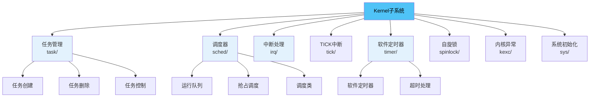
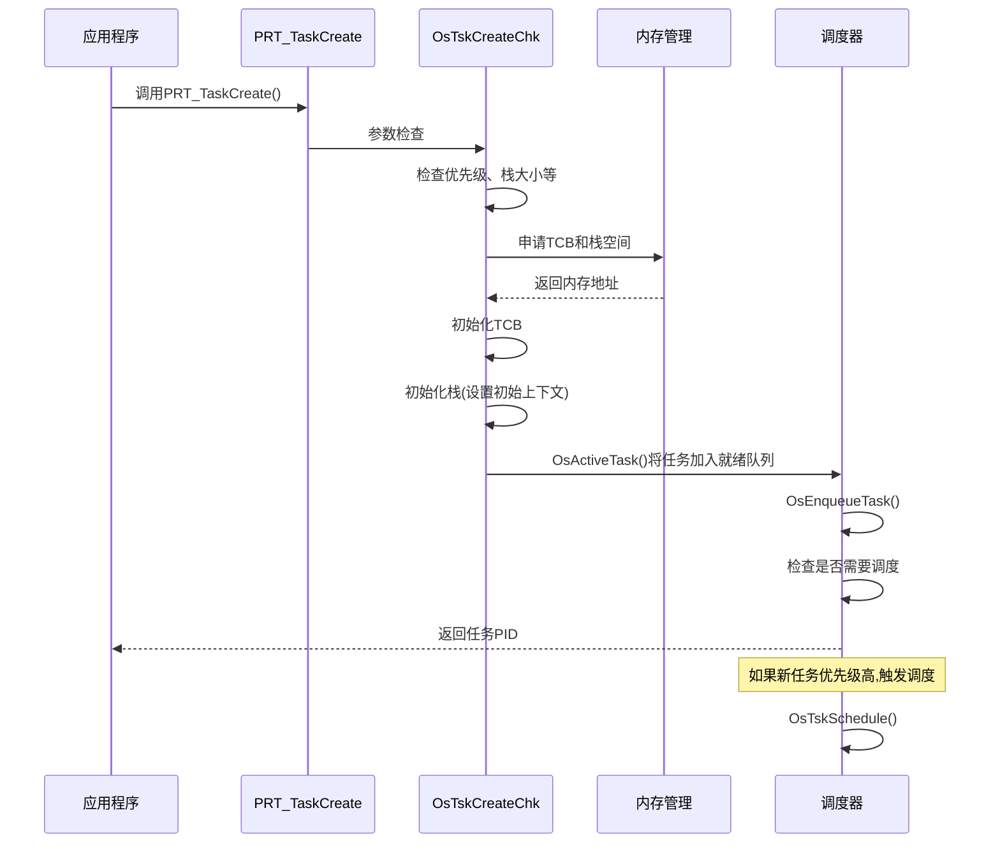
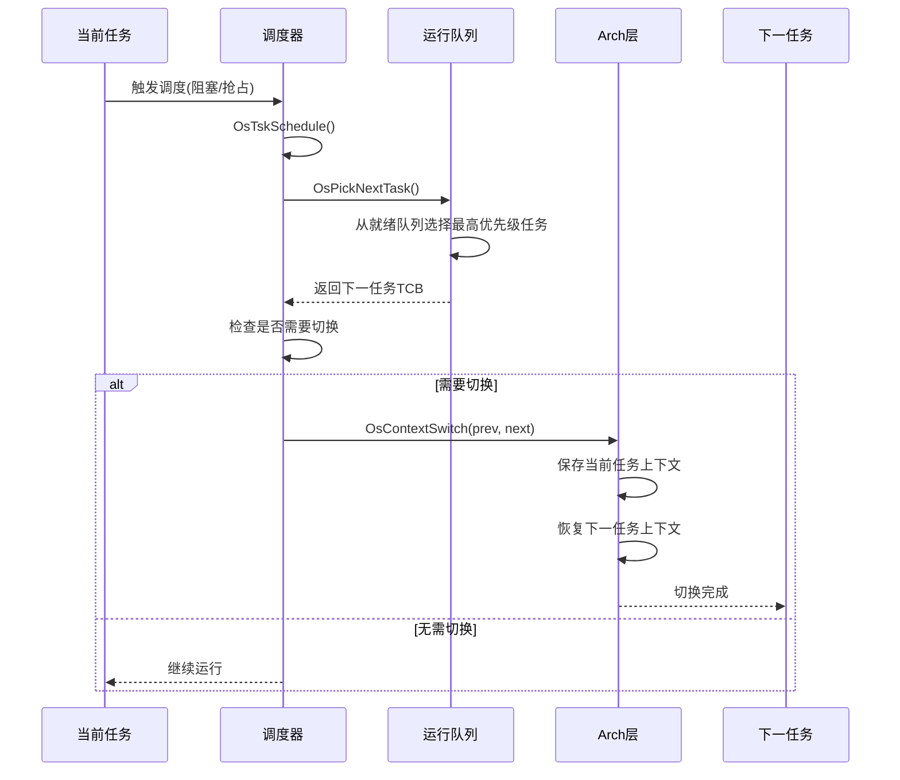
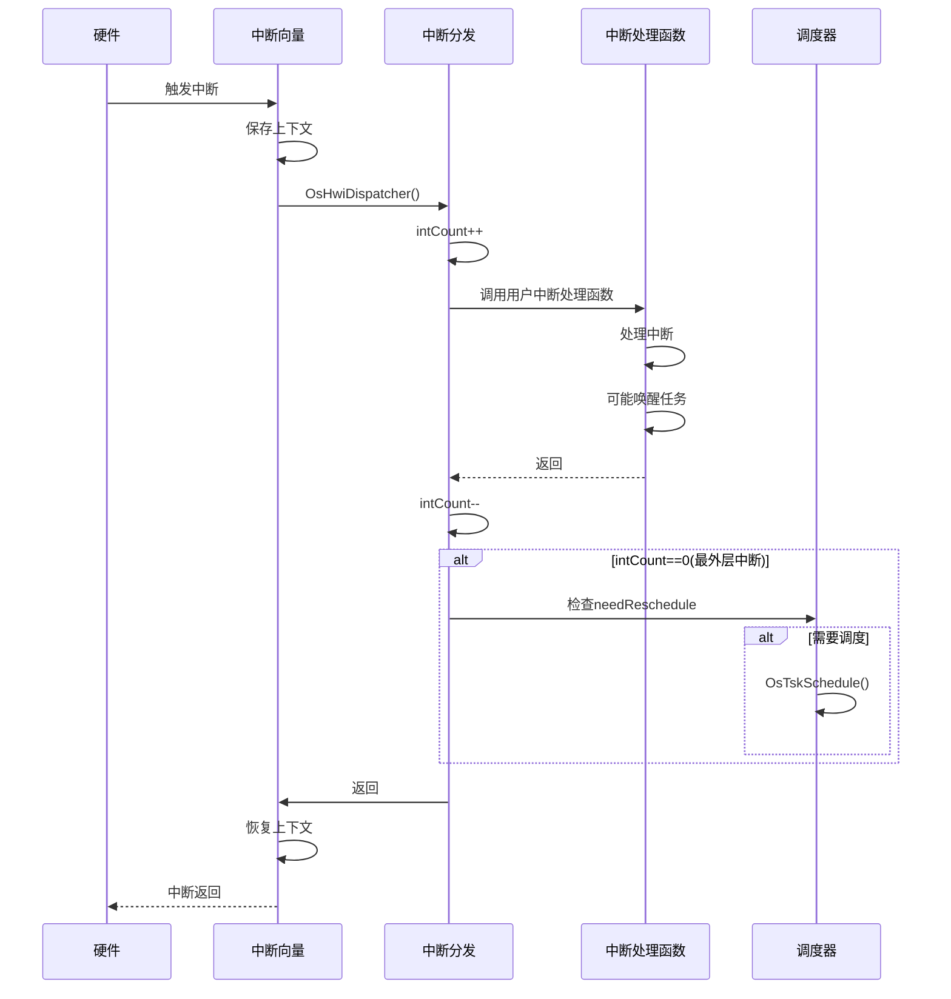
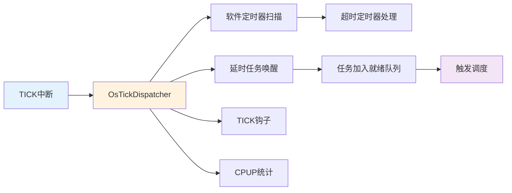

# Kernel子系统概述

> Kernel子系统是UniProton RTOS的核心，负责任务管理、调度、中断处理和定时器等关键功能。

## 📌 目录

1. [子系统职责](#子系统职责)
2. [模块组成](#模块组成)
3. [核心数据结构](#核心数据结构)
4. [调用关系](#调用关系)
5. [学习路线](#学习路线)

---

## 子系统职责

Kernel子系统实现操作系统的核心功能：

### 核心功能模块



### 功能统计

| 模块 | 源文件数 | 主要功能 | 核心API数量 |
|------|---------|---------|-----------|
| **task/** | 10个 | 任务创建、删除、控制、优先级管理 | ~20个 |
| **sched/** | 5个 | 调度器、运行队列、调度算法 | ~5个(内部) |
| **irq/** | 2个 | 中断管理、中断嵌套 | ~8个 |
| **tick/** | 3个 | TICK处理、系统时钟 | ~5个 |
| **timer/swtmr/** | 4个 | 软件定时器、超时处理 | ~10个 |

**代码位置**：`src/core/kernel/`

---

## 模块组成

### 目录结构

```
src/core/kernel/
├── include/                    # 模块间公共头文件
│   ├── prt_task_external.h     # 任务对外接口
│   ├── prt_sched_external.h    # 调度器对外接口
│   ├── prt_rt_external.h       # 实时调度接口
│   ├── prt_swtmr_external.h    # 软件定时器接口
│   ├── prt_irq_external.h      # 中断对外接口
│   └── prt_tick_external.h     # TICK对外接口
├── task/                       # 任务管理
│   ├── amp/                    # AMP模式任务
│   │   ├── prt_task_init.c     # 任务初始化和创建
│   │   ├── prt_task.c          # 任务基本操作
│   │   ├── prt_task_del.c      # 任务删除
│   │   ├── prt_task_info.c     # 任务信息查询
│   │   ├── prt_task_priority.c # 优先级管理
│   │   └── ...
│   └── smp/                    # SMP模式任务
├── sched/                      # 调度器
│   ├── prt_sched.c             # 主调度器
│   ├── prt_rt_single.c         # 单核实时调度
│   ├── prt_sched_class.c       # 调度类
│   └── prt_sched_init.c        # 调度器初始化
├── irq/                        # 中断处理
│   ├── prt_irq.c               # 中断管理
│   └── prt_irq_minor.c         # 中断次要功能
├── tick/                       # TICK中断
│   ├── prt_tick.c              # TICK处理
│   ├── prt_tick_init.c         # TICK初始化
│   └── prt_tick_minor.c        # TICK次要功能
├── timer/swtmr/                # 软件定时器
│   ├── prt_swtmr.c             # 定时器主逻辑
│   ├── prt_swtmr_init.c        # 定时器初始化
│   ├── prt_swtmr_minor.c       # 定时器次要功能
│   └── prt_swtmr_info.c        # 定时器信息查询
├── spinlock/                   # 自旋锁
├── kexc/                       # 内核异常
└── sys/                        # 系统初始化和时间
```

---

## 核心数据结构

### 1. 任务控制块 (Task Control Block)

**定义位置**：`src/core/kernel/include/prt_task_external.h:106`

```c
struct TagTskCb {
    void *stackPointer;              // 当前任务SP
    U32 taskStatus;                   // 任务状态
    TskPrior priority;                // 运行优先级(数字越小优先级越高)
    U16 stackCfgFlg;                  // 任务栈配置标记
    U32 stackSize;                    // 任务栈大小
    TskHandle taskPid;                // 任务PID
    uintptr_t topOfStack;             // 任务栈顶
    TskEntryFunc taskEntry;           // 任务入口函数
    void *taskPend;                   // 信号量/队列Pend指针
    uintptr_t args[4];                // 任务参数
    char name[OS_TSK_NAME_LEN];       // 任务名称
    TskPrior origPriority;            // 原始优先级
    struct TagListObject pendList;    // 信号量链表
    struct TagListObject timerList;   // 延时链表
    struct TagListObject semBList;    // 持有互斥信号量链表
    U32 event;                        // 任务事件
    U32 eventMask;                    // 任务事件掩码
    U32 lastErr;                      // 最后错误码
    U64 expirationTick;               // 恢复时间点

#if defined(OS_OPTION_SMP)
    volatile U32 taskOperating;       // 任务操作类型
    U32 opBusy;                       // 操作忙标志
    OS_CORE_MASK coreAllowedMask;     // 可执行的核bitmap
    U32 nrCoresAllowed;               // 可执行的核个数
    U32 coreID;                       // 任务所处核号
    bool isOnRq;                      // 是否在运行队列
    struct TagScheduleClass *scheClass; // 调度类
#endif
};
```

**关键字段说明**：
- `stackPointer`：保存任务切换时的寄存器上下文
- `priority`：当前运行优先级，会因优先级继承而变化
- `origPriority`：原始优先级，不会变化
- `taskStatus`：任务状态（就绪、运行、阻塞等）
- `expirationTick`：任务恢复时间点，用于延时和超时

### 2. 运行队列 (Run Queue)

**定义位置**：`src/core/kernel/include/prt_sched_external.h:69`

```c
struct TagOsRunQue {
    volatile uintptr_t spinLock;      // 操作RQ的锁(SMP)
    U32 uniFlag;                      // 统一标志
    struct TagTskCb *tskCurr;         // 当前运行任务
    bool needReschedule;              // 是否需要调度
    U32 rqCoreId;                     // 运行队列所属核
    U32 tskIdlePID;                   // idle任务PID
    U32 nrRunning;                    // 总运行任务个数
    U32 intCount;                     // 中断进入次数
    U32 tickNoRespondCnt;             // tick待响应次数
    U16 uniTaskLock;                  // 锁任务计数
    U32 shakeCount;                   // 核间握手计数
    bool online;                      // 队列是否在线
    U32 currntPrio;                   // 最高优先级
    struct RtRq rtRq;                 // 实时优先级运行队列
    struct TagScheduleClass *schedClass; // 调度方法
};
```

**全局变量**：
```c
extern struct TagOsRunQue g_runQueue[OS_MAX_CORE_NUM];
```

### 3. 软件定时器控制块

**定义位置**：`src/core/kernel/include/prt_swtmr_external.h:43`

```c
struct TagSwTmrCtrl {
    struct TagSwTmrCtrl *prev;       // 前一个定时器
    struct TagSwTmrCtrl *next;       // 下一个定时器
    U8 state;                         // 定时器状态
    U8 mode;                          // 定时器类型
    U16 swtmrIndex;                   // 软件定时器序号
    U32 idxRollNum;                   // SortLink属性
    U32 interval;                     // 超时时间
    U8 overrun;                       // 超时次数
    U32 arg1, arg2, arg3, arg4;      // 用户参数
    TmrProcFunc handler;              // 超时处理函数
#if defined(OS_OPTION_SMP)
    U32 coreID;
    U64 expectedTick;
#endif
};
```

---

## 调用关系

### 任务创建流程



**关键函数**：
- `PRT_TaskCreate()` - `src/core/kernel/task/amp/prt_task_init.c`
- `OsTskCreateChk()` - 任务创建检查
- `OsActiveTask()` - 激活任务，加入运行队列
- `OsEnqueueTask()` - 将任务加入就绪队列

### 任务调度流程



**关键函数**：
- `OsTskSchedule()` - `src/core/kernel/sched/prt_sched.c` - 主调度函数
- `OsPickNextTask()` - 选择下一个运行任务
- `OsContextSwitch()` - `src/arch/` - 上下文切换(架构相关)

### 中断处理流程



### TICK中断流程



---

## 学习路线

### 初学者路径

**推荐阅读顺序**：

1. **[任务管理详解](./task.md)** ⭐⭐⭐⭐⭐
   - 理解任务控制块结构
   - 掌握任务创建、删除、挂起、恢复
   - 理解任务状态转换

2. **[调度器实现](./scheduler.md)** ⭐⭐⭐⭐⭐
   - 理解运行队列
   - 掌握抢占式调度原理
   - 理解优先级调度算法

3. **[TICK中断](./tick.md)** ⭐⭐⭐
   - 理解系统时钟机制
   - 掌握TICK处理流程

4. **[软件定时器](./timer.md)** ⭐⭐⭐⭐
   - 理解定时器排序链表
   - 掌握超时处理机制

5. **[中断处理机制](./irq.md)** ⭐⭐⭐
   - 理解中断嵌套
   - 掌握中断与调度的关系

### 进阶开发者路径

**深入研究方向**：

1. **SMP调度机制**
   - 多核运行队列管理
   - 任务迁移和负载均衡
   - 自旋锁和核间同步

2. **优先级继承**
   - 互斥信号量与优先级继承
   - 优先级翻转问题

3. **性能优化**
   - 调度器性能优化
   - 上下文切换优化
   - 中断响应时延优化

### 核心代码阅读清单

| 优先级 | 文件路径 | 说明 | 大小 |
|-------|---------|------|------|
| ⭐⭐⭐⭐⭐ | `task/amp/prt_task_init.c` | 任务创建核心逻辑 | 12KB |
| ⭐⭐⭐⭐⭐ | `sched/prt_sched.c` | 调度器主逻辑 | 5KB |
| ⭐⭐⭐⭐ | `sched/prt_rt_single.c` | 实时调度实现 | 4KB |
| ⭐⭐⭐⭐ | `task/amp/prt_task.c` | 任务基本操作 | - |
| ⭐⭐⭐⭐ | `timer/swtmr/prt_swtmr.c` | 软件定时器主逻辑 | 10KB |
| ⭐⭐⭐ | `irq/prt_irq.c` | 中断管理 | - |
| ⭐⭐⭐ | `tick/prt_tick.c` | TICK处理 | - |

---

## 核心API速查

### 任务管理API

```c
// 任务创建
U32 PRT_TaskCreate(TskHandle *taskPid, struct TskInitParam *initParam);

// 任务删除
U32 PRT_TaskDelete(TskHandle taskPid);

// 任务挂起/恢复
U32 PRT_TaskSuspend(TskHandle taskPid);
U32 PRT_TaskResume(TskHandle taskPid);

// 任务延时
U32 PRT_TaskDelay(U32 tick);

// 优先级管理
U32 PRT_TaskPrioritySet(TskHandle taskPid, TskPrior taskPrio);
U32 PRT_TaskPriorityGet(TskHandle taskPid, TskPrior *taskPrio);

// 任务信息查询
U32 PRT_TaskGetInfo(TskHandle taskPid, struct TskInfo *taskInfo);
U32 PRT_TaskSelf(TskHandle *taskPid);
```

### 软件定时器API

```c
// 创建/删除定时器
U32 PRT_SwTmrCreate(struct SwTmrCreatePara *createPara, TimerHandle *timerHandle);
U32 PRT_SwTmrDelete(TimerHandle timerHandle);

// 启动/停止定时器
U32 PRT_SwTmrStart(TimerHandle timerHandle);
U32 PRT_SwTmrStop(TimerHandle timerHandle);

// 获取定时器信息
U32 PRT_SwTmrGetInfo(TimerHandle timerHandle, struct SwTmrInfo *timerInfo);
```

### 中断管理API

```c
// 创建/删除中断
U32 PRT_HwiCreate(HwiNum hwiNum, HwiPrior hwiPrio, HwiMode mode,
                  HwiProcFunc handler, HwiArg arg);
U32 PRT_HwiDelete(HwiNum hwiNum);

// 使能/禁用中断
U32 PRT_HwiEnable(HwiNum hwiNum);
U32 PRT_HwiDisable(HwiNum hwiNum);
```

---

## 下一步

选择一个模块开始详细学习：

- **[任务管理详解](./task.md)** - 深入理解任务创建、状态转换、优先级管理
- **[调度器实现](./scheduler.md)** - 深入理解抢占式调度、运行队列、调度算法
- **[软件定时器](./timer.md)** - 深入理解定时器机制、排序链表、超时处理
- **[中断处理机制](./irq.md)** - 深入理解中断管理、中断嵌套
- **[TICK中断](./tick.md)** - 深入理解系统时钟、TICK处理

---

[返回主目录](../README.md) | [整体架构](../architecture/overview.md)
