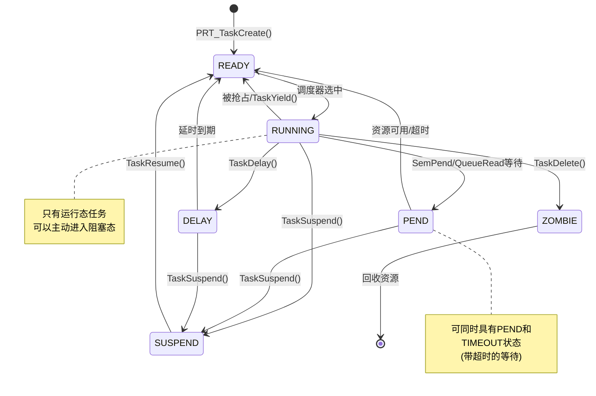
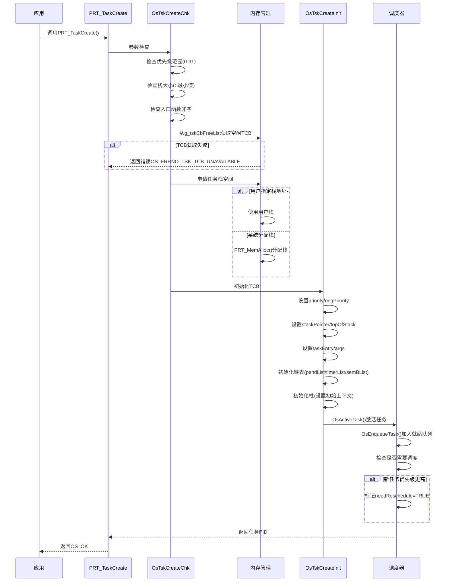
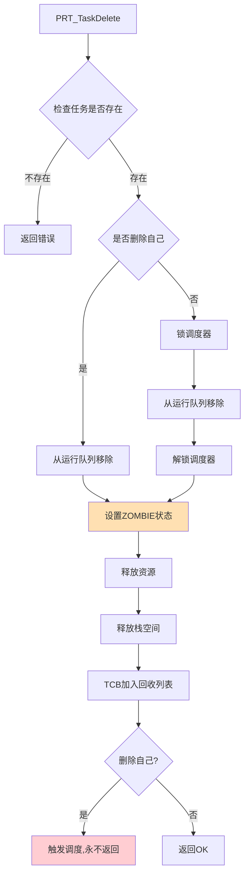
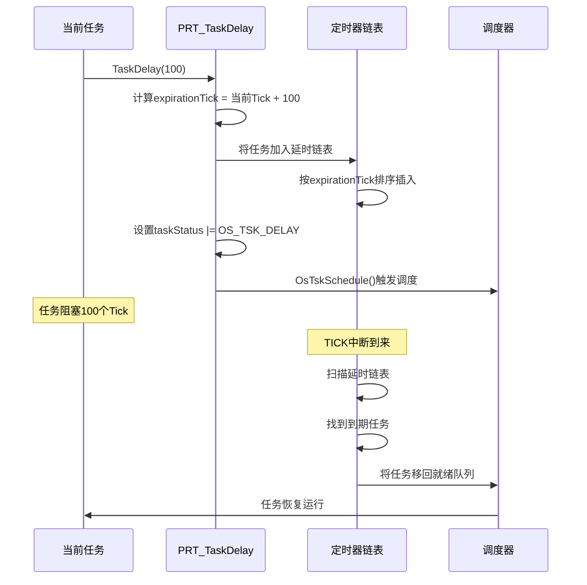
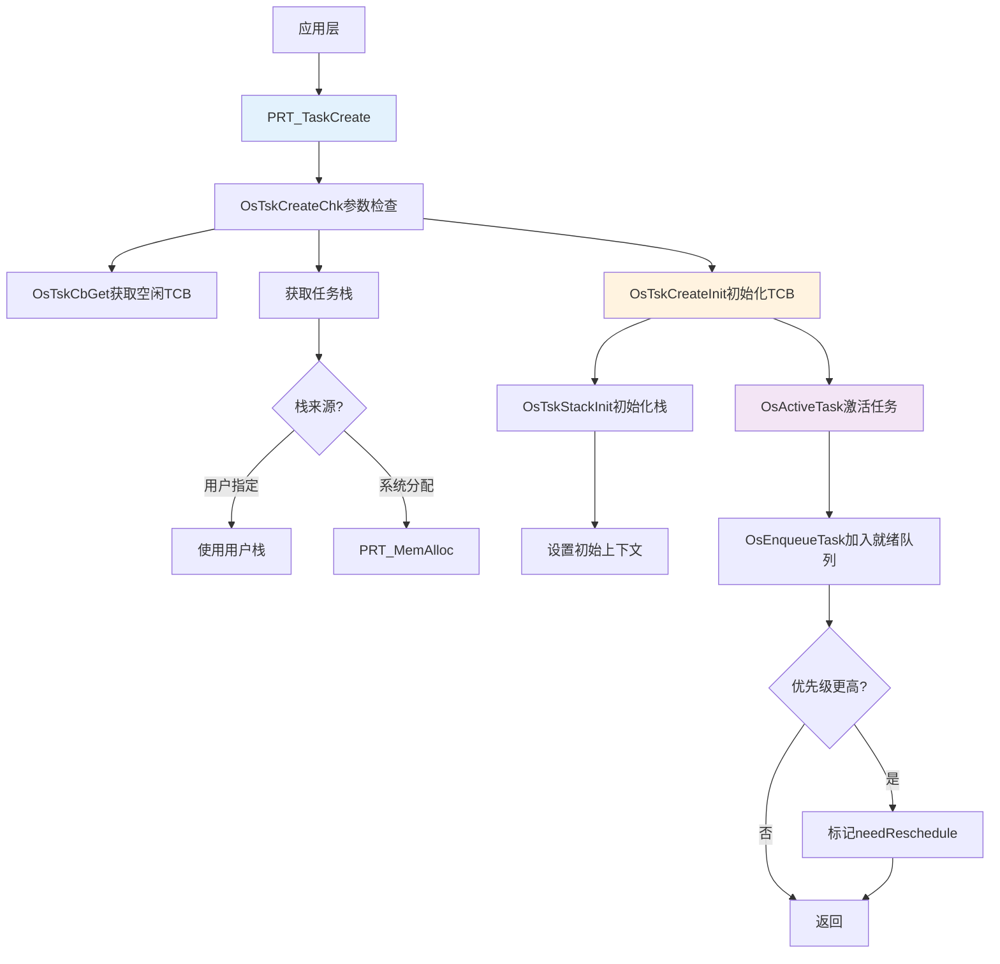
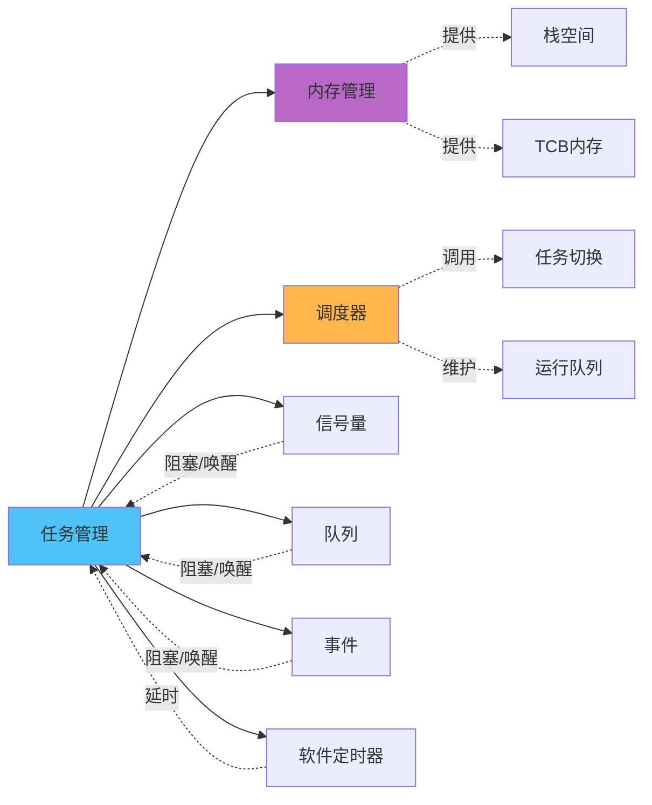

# Kernel - 任务管理详解

> 本文深入分析UniProton的任务管理机制，包括任务控制块、任务状态转换、任务创建删除流程等核心内容。

## 📌 目录

1. [模块功能说明](#模块功能说明)
2. [核心数据结构](#核心数据结构)
3. [代码实现分析](#代码实现分析)
4. [调用关系图](#调用关系图)
5. [学习要点总结](#学习要点总结)

---

## 模块功能说明

### 职责范围

任务管理模块(`src/core/kernel/task/`)负责：

- ✅ 任务生命周期管理：创建、删除、挂起、恢复
- ✅ 任务优先级管理：设置、获取、优先级继承
- ✅ 任务状态管理：就绪、运行、阻塞、挂起
- ✅ 任务信息查询：获取任务信息、任务名称
- ✅ 任务同步机制：延时、等待、信号量pend
- ✅ 周期任务支持：周期性任务调度

### 文件组织

```
src/core/kernel/task/
├── amp/                           # AMP模式任务(单核或非对称多核)
│   ├── prt_task_init.c            # 任务创建和初始化 (12KB)
│   ├── prt_task.c                 # 任务基本操作(挂起/恢复/延时)
│   ├── prt_task_del.c             # 任务删除
│   ├── prt_task_info.c            # 任务信息查询 (6.5KB)
│   ├── prt_task_priority.c        # 优先级管理
│   ├── prt_task_minor.c           # 次要功能
│   ├── prt_task_period.c          # 周期任务
│   ├── prt_task_sem.c             # 任务信号量
│   ├── prt_amp_task.c             # AMP特定功能
│   └── prt_amp_psci.c             # PSCI电源管理
└── smp/                           # SMP模式任务(对称多核)
    └── ...                        # SMP特定实现
```

---

## 核心数据结构

### 1. 任务控制块 (TCB)

**定义位置**：`src/core/kernel/include/prt_task_external.h:106`

```c
struct TagTskCb {
    /* === 基础字段 === */
    void *stackPointer;              // 当前任务SP，保存任务上下文
    U32 taskStatus;                   // 任务状态(就绪/运行/阻塞等)
    TskPrior priority;                // 运行优先级(0-31,数字越小优先级越高)
    U16 stackCfgFlg;                  // 任务栈配置标记
    U32 stackSize;                    // 任务栈大小(字节)
    TskHandle taskPid;                // 任务PID(唯一标识)
    uintptr_t topOfStack;             // 任务栈顶地址
    TskEntryFunc taskEntry;           // 任务入口函数指针

    /* === 同步/阻塞相关 === */
    void *taskPend;                   // 指向当前Pend的信号量或队列
    uintptr_t args[4];                // 任务参数(最多4个)
    TskPrior origPriority;            // 原始优先级(用于优先级继承恢复)
    struct TagListObject pendList;    // 挂接到信号量等待链表
    struct TagListObject timerList;   // 挂接到延时链表
    struct TagListObject semBList;    // 持有的互斥信号量链表
    U64 expirationTick;               // 任务恢复的时间点(Tick)

    /* === 事件相关 === */
    U32 event;                        // 任务事件标志组
    U32 eventMask;                    // 任务事件掩码

    /* === 调试信息 === */
    char name[OS_TSK_NAME_LEN];       // 任务名称
    U32 lastErr;                      // 最后一次错误码

    /* === SMP多核相关 === */
#if defined(OS_OPTION_SMP)
    volatile U32 taskOperating;       // 任务正在进行的操作类型
    U32 opBusy;                       // 操作忙标志(防止并发操作)
    OS_CORE_MASK coreAllowedMask;     // 可执行的核bitmap
    U32 nrCoresAllowed;               // 可执行的核个数
    U32 coreID;                       // 任务所处的核号
    bool isOnRq;                      // 是否在运行队列上
    struct TagScheduleClass *scheClass; // 调度类指针
#endif

    /* === POSIX支持 === */
#if defined(OS_OPTION_POSIX)
    U8 state;                         // POSIX状态
    U8 cancelState;                   // pthread cancel状态
    void *retval;                     // pthread退出值
    SemHandle joinableSem;            // join用信号量
    void *tsd[PTHREAD_KEYS_MAX];      // Thread Specific Data
    // ... 更多POSIX字段
#endif
};
```

**关键字段说明**：

| 字段 | 说明 | 使用场景 |
|------|------|---------|
| `stackPointer` | 任务切换时保存的SP | 上下文切换时保存/恢复寄存器 |
| `priority` | 当前运行优先级 | 会因优先级继承而变化 |
| `origPriority` | 原始优先级 | 优先级继承结束后恢复使用 |
| `taskPend` | Pend对象指针 | 任务阻塞在信号量/队列时指向该对象 |
| `expirationTick` | 恢复时间点 | 延时或超时等待时使用 |
| `semBList` | 持有的互斥信号量 | 优先级继承需要知道任务持有哪些锁 |

### 2. 任务状态定义

```c
// 任务状态宏定义
#define OS_TSK_SUSPEND      0x0001    // 任务被挂起
#define OS_TSK_READY        0x0002    // 任务就绪
#define OS_TSK_PEND         0x0004    // 任务阻塞(等待资源)
#define OS_TSK_RUNNING      0x0008    // 任务运行
#define OS_TSK_DELAY        0x0010    // 任务延时
#define OS_TSK_TIMEOUT      0x0020    // 任务超时
#define OS_TSK_ZOMBIE       0x0080    // 僵尸任务(等待回收)
```

**状态转换图**：



### 3. 任务初始化参数

```c
struct TskInitParam {
    TskEntryFunc taskEntry;          // 任务入口函数
    U16 policy;                      // 调度策略
    TskPrior taskPrio;               // 任务优先级(0-31)
    uintptr_t args[4];               // 任务参数
    U32 stackSize;                   // 栈大小
    char *name;                      // 任务名称
    U32 timeSlice;                   // 时间片(RR调度使用)
    U32 stackAddr;                   // 用户指定栈地址(可选)
};
```

---

## 代码实现分析

### 1. 任务创建流程

**API入口**：`PRT_TaskCreate()` - `src/core/kernel/task/amp/prt_task_init.c`

#### 完整流程图



#### 关键代码片段分析

**1. TCB初始化** (`prt_task_init.c`)

```c
static void OsTskCreateInit(struct TagTskCb *taskCb,
                            struct TskInitParam *initParam)
{
    // 设置优先级
    taskCb->priority = initParam->taskPrio;
    taskCb->origPriority = initParam->taskPrio;

    // 设置栈信息
    taskCb->topOfStack = (uintptr_t)initParam->stackAddr;
    taskCb->stackSize = initParam->stackSize;
    taskCb->stackPointer = (void *)OsTskStackInit(...);  // 初始化栈

    // 设置入口函数和参数
    taskCb->taskEntry = initParam->taskEntry;
    taskCb->args[0] = initParam->args[0];
    taskCb->args[1] = initParam->args[1];
    taskCb->args[2] = initParam->args[2];
    taskCb->args[3] = initParam->args[3];

    // 初始化链表
    INIT_LIST_OBJECT(&taskCb->pendList);
    INIT_LIST_OBJECT(&taskCb->timerList);
    INIT_LIST_OBJECT(&taskCb->semBList);

    // 设置任务状态为就绪
    taskCb->taskStatus = OS_TSK_READY;
}
```

**2. 栈初始化** - 设置初始上下文

```c
// 栈从高地址向低地址增长
// 栈顶预设寄存器初始值，任务首次调度时恢复这些值
uintptr_t OsTskStackInit(uintptr_t stackTop,
                         TskEntryFunc taskEntry,
                         uintptr_t *args)
{
    struct TskContext *context;

    // 栈顶向下预留context空间
    stackTop -= sizeof(struct TskContext);
    context = (struct TskContext *)stackTop;

    // 设置初始寄存器值(架构相关)
    context->pc = (uintptr_t)taskEntry;  // PC指向入口函数
    context->x0 = args[0];               // 参数1
    context->x1 = args[1];               // 参数2
    context->x2 = args[2];               // 参数3
    context->x3 = args[3];               // 参数4
    context->spsr = INIT_STATUS_REG;     // 状态寄存器

    return stackTop;  // 返回新的栈顶
}
```

### 2. 任务删除流程

**API入口**：`PRT_TaskDelete()` - `src/core/kernel/task/amp/prt_task_del.c`



**注意事项**：
- 删除自己的任务会触发调度，永不返回
- 删除其他任务需要加锁，防止并发问题
- 资源释放包括：用户栈、持有的信号量等

### 3. 任务挂起/恢复

**挂起流程** `PRT_TaskSuspend()`：

```c
U32 PRT_TaskSuspend(TskHandle taskPid)
{
    struct TagTskCb *taskCb;

    // 参数检查
    taskCb = GET_TCB_HANDLE(taskPid);

    // 设置SUSPEND状态
    taskCb->taskStatus |= OS_TSK_SUSPEND;

    // 如果任务在就绪队列，移除
    if (taskCb->taskStatus == (OS_TSK_READY | OS_TSK_SUSPEND)) {
        OsDequeueTask(runQue, taskCb, OS_TSK_STATUS_SUSPEND);
    }

    // 如果挂起自己，触发调度
    if (taskPid == RUNNING_TASK->taskPid) {
        OsTskSchedule();
    }

    return OS_OK;
}
```

**恢复流程** `PRT_TaskResume()`：

```c
U32 PRT_TaskResume(TskHandle taskPid)
{
    struct TagTskCb *taskCb;

    taskCb = GET_TCB_HANDLE(taskPid);

    // 清除SUSPEND状态
    taskCb->taskStatus &= ~OS_TSK_SUSPEND;

    // 如果只有SUSPEND状态，现在变为READY，加入就绪队列
    if (taskCb->taskStatus == OS_TSK_READY) {
        OsEnqueueTask(runQue, taskCb, OS_TSK_STATUS_READY);

        // 检查是否需要调度
        if (taskCb->priority < RUNNING_TASK->priority) {
            OsTskSchedule();
        }
    }

    return OS_OK;
}
```

### 4. 任务延时

**API**：`PRT_TaskDelay(U32 tick)` - `src/core/kernel/task/amp/prt_task.c`



### 5. 优先级管理

**设置优先级** `PRT_TaskPrioritySet()`:

```c
U32 PRT_TaskPrioritySet(TskHandle taskPid, TskPrior taskPrio)
{
    struct TagTskCb *taskCb;
    TskPrior oldPrio;

    // 参数检查
    if (taskPrio > OS_TSK_PRIORITY_LOWEST) {
        return OS_ERRNO_TSK_PRIOR_ERROR;
    }

    taskCb = GET_TCB_HANDLE(taskPid);
    oldPrio = taskCb->priority;

    // 更新优先级
    taskCb->priority = taskPrio;
    taskCb->origPriority = taskPrio;

    // 如果任务在就绪队列，需要重新调整位置
    if (taskCb->taskStatus == OS_TSK_READY) {
        OsDequeueTask(runQue, taskCb, 0);  // 移除
        OsEnqueueTask(runQue, taskCb, 0);  // 重新插入
    }

    // 检查是否需要调度
    if (taskPrio < RUNNING_TASK->priority ||
        (taskCb == RUNNING_TASK && taskPrio > oldPrio)) {
        OsTskSchedule();
    }

    return OS_OK;
}
```

**优先级继承机制**：

当高优先级任务H等待低优先级任务L持有的互斥信号量时：
1. L的priority临时提升到H的priority
2. L的origPriority保持不变
3. L释放信号量后，priority恢复为origPriority

---

## 调用关系图

### 1. 任务创建调用链



### 2. 任务与其他模块交互



---

## 学习要点总结

### 核心概念掌握

#### 1. 任务状态理解

**关键点**：
- 任务状态可以**组合**：如`PEND | SUSPEND`
- 只有`READY`状态的任务才能被调度
- `RUNNING`状态只有一个任务（单核）
- `ZOMBIE`状态任务等待资源回收

**常见状态组合**：
```c
// 就绪
OS_TSK_READY

// 运行
OS_TSK_RUNNING

// 延时
OS_TSK_DELAY

// 等待信号量
OS_TSK_PEND

// 等待信号量+超时
OS_TSK_PEND | OS_TSK_TIMEOUT

// 挂起+延时
OS_TSK_SUSPEND | OS_TSK_DELAY
```

#### 2. 优先级设计

**优先级范围**：0-31（0最高，31最低）

**特殊优先级**：
```c
#define OS_TSK_PRIORITY_HIGHEST  0      // 最高优先级
#define OS_TSK_PRIORITY_LOWEST   31     // 最低优先级(IDLE任务)
```

**优先级继承**：
- 目的：避免优先级翻转
- 机制：低优先级任务临时提升到高优先级
- 恢复：释放互斥信号量后恢复原优先级

#### 3. 栈空间管理

**栈布局**（高地址→低地址）：
```
┌─────────────────┐ ← topOfStack (栈顶)
│  Magic Word     │   (栈溢出检测)
├─────────────────┤
│  未使用空间     │
├─────────────────┤
│  局部变量       │
├─────────────────┤
│  保存的寄存器   │ ← stackPointer (当前SP)
├─────────────────┤
│  初始上下文     │   (首次调度时使用)
└─────────────────┘ ← 栈底
```

**栈大小配置**：
- 最小栈大小：`OS_TSK_MIN_STACK_SIZE` (架构相关)
- 默认栈大小：可在配置中设置
- 栈对齐：通常16字节对齐

### 常见问题与陷阱

#### 1. 任务删除自己

```c
// ❌ 错误：删除自己后继续执行
PRT_TaskDelete(PRT_TaskSelf());
printf("This will never execute!\n");  // 永不执行

// ✅ 正确：知道删除自己会触发调度
PRT_TaskDelete(PRT_TaskSelf());
// 函数到此结束，后续代码不会执行
```

#### 2. 优先级配置

```c
// ❌ 错误：优先级越大越高?
PRT_TaskCreate(&pid, &param);  // param.taskPrio = 30 (低优先级)

// ✅ 正确：优先级数字越小越高
param.taskPrio = 5;  // 高优先级任务
```

#### 3. 栈大小不足

```c
// ❌ 危险：栈太小，可能溢出
param.stackSize = 512;  // 太小
void task_func(void) {
    char big_array[1024];  // 栈溢出!
}

// ✅ 安全：评估栈使用，留足余量
param.stackSize = 4096;  // 根据实际需求设置
```

### 最佳实践

#### 1. 任务优先级分配

```c
// 推荐优先级分配策略
#define PRIORITY_CRITICAL    5    // 关键实时任务
#define PRIORITY_HIGH        10   // 高优先级任务
#define PRIORITY_NORMAL      15   // 普通任务
#define PRIORITY_LOW         20   // 低优先级任务
#define PRIORITY_BACKGROUND  25   // 后台任务
```

#### 2. 任务命名

```c
// ✅ 良好的任务命名
struct TskInitParam param = {
    .name = "sensor_read",
    .taskEntry = SensorReadTask,
    .taskPrio = PRIORITY_HIGH,
    .stackSize = 2048,
};
```

#### 3. 错误处理

```c
// ✅ 完整的错误处理
U32 ret;
TskHandle taskPid;

ret = PRT_TaskCreate(&taskPid, &initParam);
if (ret != OS_OK) {
    switch (ret) {
    case OS_ERRNO_TSK_NO_MEMORY:
        printf("Out of memory\n");
        break;
    case OS_ERRNO_TSK_TCB_UNAVAILABLE:
        printf("No free TCB\n");
        break;
    case OS_ERRNO_TSK_PRIOR_ERROR:
        printf("Invalid priority\n");
        break;
    default:
        printf("Task create failed: 0x%x\n", ret);
    }
    return ERROR;
}
```

### 性能优化要点

#### 1. 减少任务切换

- 合理设置任务优先级，避免频繁抢占
- 批量处理，减少任务间通信次数
- 使用任务池，避免频繁创建/删除

#### 2. 栈空间优化

- 精确评估栈需求，避免浪费
- 使用栈检查工具（Magic Word）
- 大数组使用堆分配而非栈

### 调试技巧

#### 1. 查看任务信息

```c
struct TskInfo info;
TskHandle taskPid;

PRT_TaskSelf(&taskPid);
PRT_TaskGetInfo(taskPid, &info);

printf("Task: %s, Priority: %u, Status: 0x%x\n",
       info.name, info.taskPrio, info.taskStatus);
```

#### 2. 检测栈溢出

```c
// 系统通常会在栈顶/栈底放置Magic Word
// 定期检查Magic Word是否被破坏
if (taskCb->magicWord != OS_TASK_MAGIC) {
    printf("Stack overflow detected!\n");
}
```

---

## 下一步学习

- **[调度器实现](./scheduler.md)** - 理解任务如何被选中运行
- **[中断处理](./irq.md)** - 理解中断如何影响任务调度
- **[信号量机制](../ipc/semaphore.md)** - 理解任务如何同步

---

[返回Kernel概述](./README.md) | [返回主目录](../README.md)
