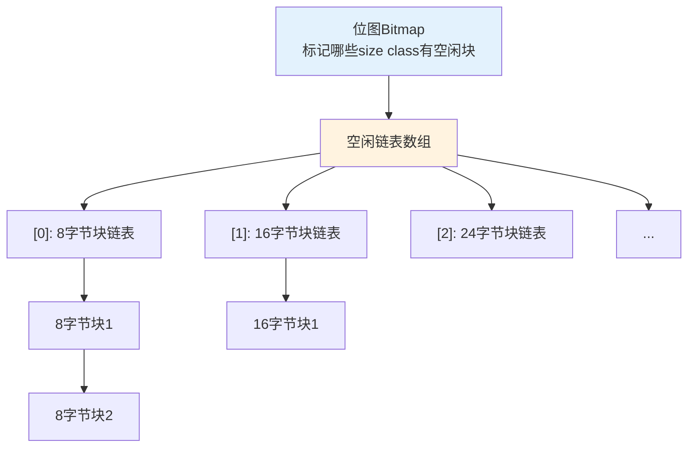
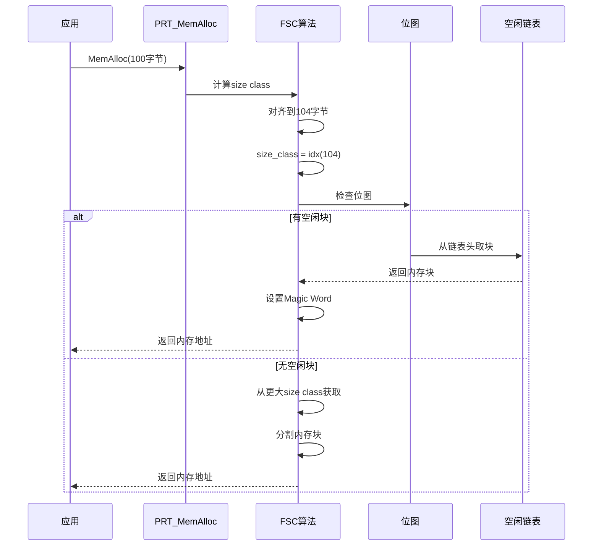

# Mem子系统概述

> Mem子系统负责UniProton的内存管理，采用FSC(Fast Size Class)算法实现高效的内存分配和释放。

## 📌 核心功能

### 职责范围

- ✅ 内存分区管理：支持多个独立内存分区
- ✅ 内存分配/释放：基于FSC算法的快速分配
- ✅ 内存对齐：支持4字节对齐和自定义对齐
- ✅ 内存保护：Magic Word检测内存越界
- ✅ 内存统计：跟踪内存使用情况

**代码位置**：`src/mem/`

---

## 模块组成

```
src/mem/
├── include/                      # 公共头文件
│   ├── prt_mem_external.h        # 内存管理对外接口
│   └── prt_fscmem_external.h     # FSC算法接口
├── prt_mem.c                     # 内存管理主逻辑
├── prt_mem_internal.h            # 内部接口
└── fsc/                          # FSC算法实现
    ├── prt_fscmem.c              # FSC算法核心代码
    └── prt_fscmem_internal.h     # FSC内部接口
```

---

## 核心数据结构

### FSC内存控制块

**定义位置**：`src/mem/include/prt_mem_external.h:39`

```c
struct TagFscMemCtrl {
    struct TagFscMemCtrl *next;      // 下一个控制块
    uintptr_t size;                  // 块大小(包含控制块)
    uintptr_t prevSize;              // 前面相邻物理块大小
    struct TagFscMemCtrl *prev;      // 上一个控制块地址
};
```

### FSC算法核心宏

```c
#define OS_MEM_HEAD_MAGICWORD       0xABAB         // 头部魔术字
#define OS_FSC_MEM_MAGIC_USED       0x5a5aa5a5     // 已用块魔术字
#define OS_FSC_MEM_TAIL_MAGIC       0xABCDDCBA     // 尾部魔术字
#define OS_FSC_MEM_ALIGN_SIZE       4              // 对齐大小

// 大小转换为索引
#define OS_FSC_MEM_SZ2IDX(size)     (((size) >> 2) - 1)

// 索引转换为位图位
#define OS_FSC_MEM_IDX2BIT(idx)     (1UL << (idx))
```

---

## FSC算法原理

### Size Class分类

```
内存块分类：
┌─────────────────────────────────────┐
│ 小块: 8-256字节，8字节递增          │
│       共31个size class                │
├─────────────────────────────────────┤
│ 中块: 256-2KB，16字节递增            │
├─────────────────────────────────────┤
│ 大块: 2KB以上，首次适配              │
└─────────────────────────────────────┘
```

### 空闲链表组织



### 分配流程



---

## 主要API

```c
// 创建内存分区
U32 PRT_MemPtCreate(void *addr, U32 size, U32 *ptNo);

// 内存分配
U32 PRT_MemAlloc(U32 mid, U32 size, void **addr);

// 对齐内存分配
U32 PRT_MemAllocAlign(U32 mid, U32 size, U32 align, void **addr);

// 内存释放
U32 PRT_MemFree(U32 mid, void *addr);

// 获取内存信息
U32 PRT_MemGetInfo(U32 mid, struct MemInfo *memInfo);
```

---

## 学习要点

### FSC算法优势

1. **O(1)时间复杂度**：分配和释放都是常数时间
2. **低碎片率**：size class设计减少外部碎片
3. **空间效率高**：位图快速定位空闲块
4. **安全性好**：Magic Word检测越界

### 内存越界检测

```c
// 内存块布局
┌──────────────────┐
│ Magic Word (头)  │  0xABAB
├──────────────────┤
│ 控制块           │  struct TagFscMemCtrl
├──────────────────┤
│ 用户数据         │  ← 返回给用户的地址
│                  │
├──────────────────┤
│ Magic Word (尾)  │  0xABCDDCBA
└──────────────────┘
```

### 最佳实践

1. **分区规划**：根据使用场景划分不同内存分区
2. **大小评估**：准确评估内存需求，避免频繁分配
3. **及时释放**：不用的内存及时释放，避免泄漏
4. **对齐要求**：根据架构选择合适的对齐大小

---

## 详细文档

- **[内存管理总览](./overview.md)** - 内存分区、对齐策略
- **[FSC算法详解](./fsc.md)** - FSC算法实现细节、位图管理

---

[返回主目录](../README.md)
