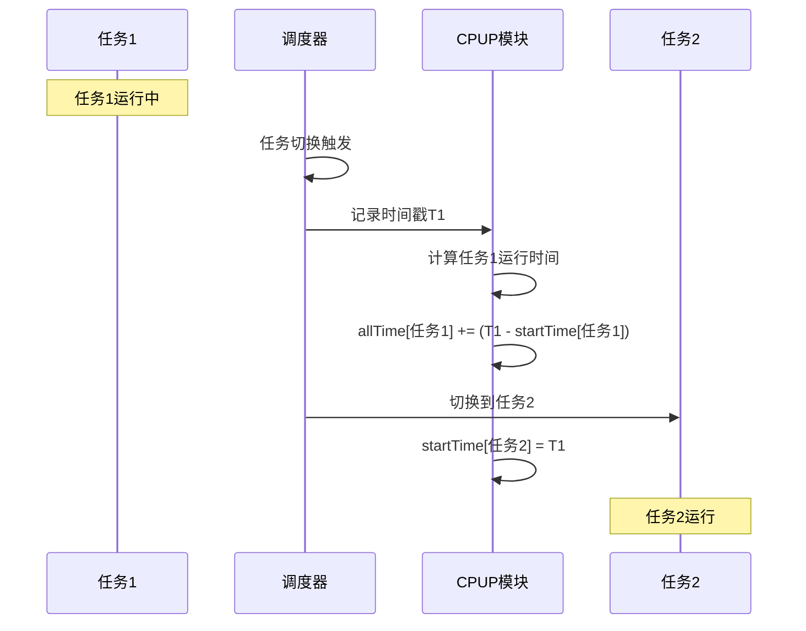
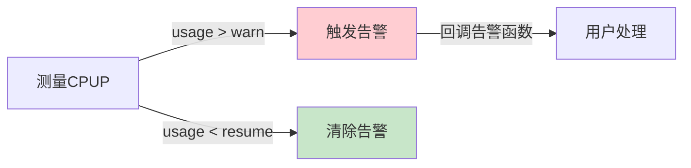
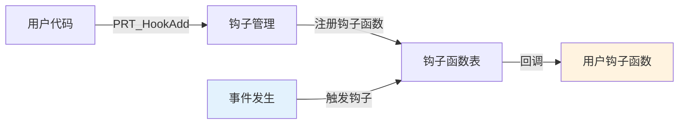
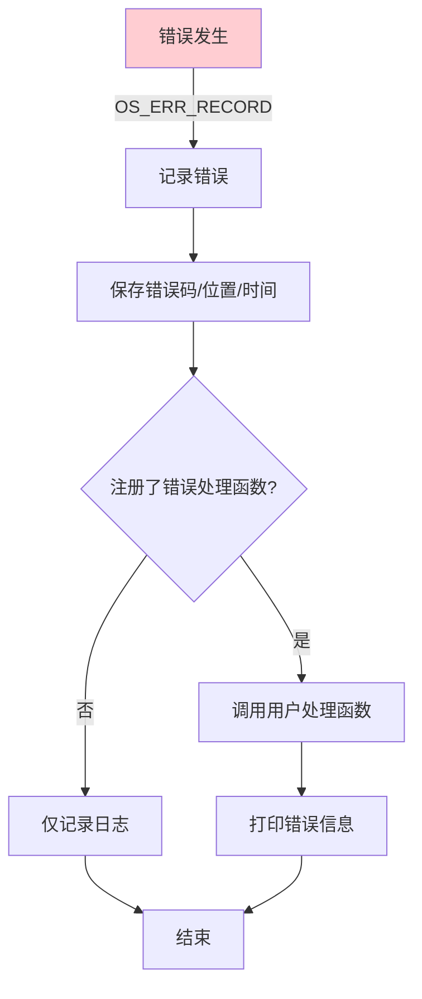
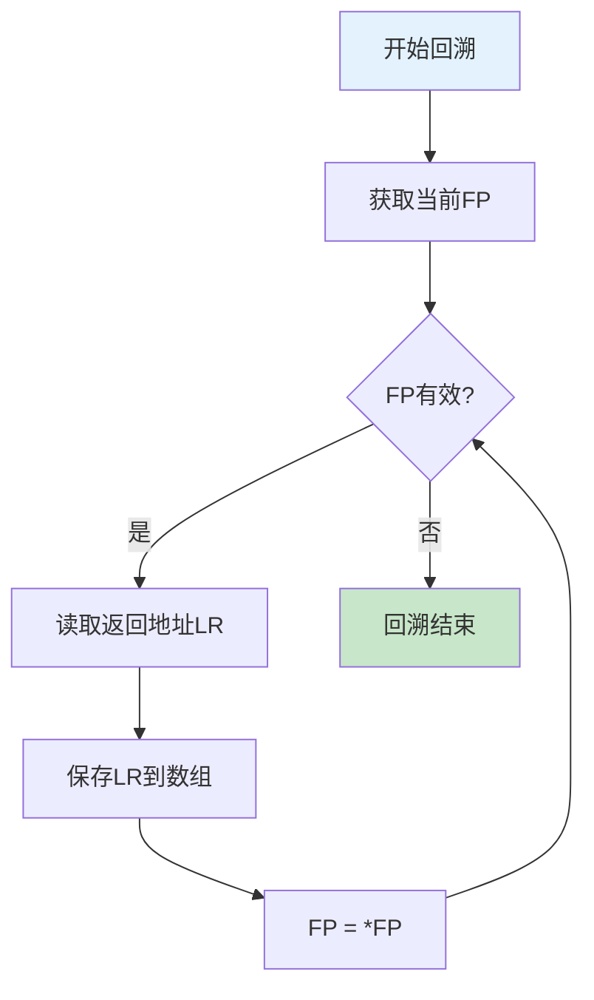

# OM子系统概述

> OM(Operation & Maintenance)子系统提供运维和调试功能，包括CPU占用率统计、钩子函数、错误处理和栈回溯等。

## 📌 核心功能

### 职责范围

- ✅ **CPUP统计**：线程级/系统级CPU占用率统计
- ✅ **钩子函数**：任务切换钩子、中断钩子、内存钩子
- ✅ **错误处理**：错误记录、错误码管理
- ✅ **栈回溯**：调用栈分析、异常定位

**代码位置**：`src/om/`

---

## 模块组成

```
src/om/
├── include/                      # 公共头文件
│   ├── prt_cpup_external.h       # CPUP接口
│   ├── prt_hook_external.h       # Hook接口
│   ├── prt_err_external.h        # 错误处理接口
│   └── prt_unwind_external.h     # 栈回溯接口
├── cpup/                         # CPU占用率
│   ├── prt_cpup.c                # CPUP主逻辑
│   ├── prt_cpup_thread.c         # 线程级CPUP
│   ├── prt_cpup_thread_64.c      # 64位线程CPUP
│   ├── prt_cpup_thread_init.c    # 线程CPUP初始化
│   ├── prt_cpup_warn.c           # CPUP告警
│   └── prt_cpup_minor.c          # CPUP次要功能
├── hook/                         # 钩子函数
│   └── prt_hook_init.c           # 钩子初始化
├── err/                          # 错误处理
│   ├── prt_err.c                 # 错误处理主逻辑
│   └── prt_err_init.c            # 错误处理初始化
└── unwind/                       # 栈回溯
    ├── prt_unwind.c              # 栈回溯主逻辑
    ├── prt_unwind_init.c         # 栈回溯初始化
    └── prt_unwind_common.c       # 栈回溯通用函数
```

---

## 核心数据结构

### 1. CPUP告警信息

**定义位置**：`src/om/include/prt_cpup_external.h:23`

```c
struct TagOsCpupWarnInfo {
    U32 warn;                         // CPU占用率告警阈值(万分比)
    U32 resume;                       // CPU占用率告警恢复阈值(万分比)
};
```

### 2. 线程级CPUP

**定义位置**：`src/om/include/prt_cpup_external.h:33`

```c
struct TagCpupThread {
    U64 allTime;                      // 运行总时间记录
    U64 startTime;                    // 调用前时间记录
    U16 usage;                        // CPU占用率(万分比)
    U16 reserve;
    U32 reserve2;
};
```

---

## 功能详解

### 1. CPU占用率统计

#### CPUP计算原理

```
CPU占用率 = (任务运行时间 / 总时间) × 10000

运行时间统计：
- 任务切换时记录时间戳
- 累计每个任务的运行时间
```

#### CPUP统计流程



#### CPUP告警机制



### 2. 钩子函数机制

#### 支持的钩子类型

```c
enum OsHookType {
    OS_HOOK_TSK_CREATE,       // 任务创建钩子
    OS_HOOK_TSK_DELETE,       // 任务删除钩子
    OS_HOOK_TSK_SWITCH,       // 任务切换钩子
    OS_HOOK_IDLE_PERIOD,      // IDLE周期钩子
    OS_HOOK_IDLE_PREFIX,      // IDLE前缀钩子
    OS_HOOK_HWI_ENTRY,        // 中断进入钩子
    OS_HOOK_HWI_EXIT,         // 中断退出钩子
    OS_HOOK_MEM_ALLOC,        // 内存分配钩子
    OS_HOOK_MEM_FREE,         // 内存释放钩子
};
```

#### 钩子注册流程



#### 使用示例

```c
// 任务切换钩子
void MyTaskSwitchHook(U32 lastTaskPID, U32 nextTaskPID)
{
    printf("Task switch: %u -> %u\n", lastTaskPID, nextTaskPID);
}

// 注册钩子
PRT_HookAdd(OS_HOOK_TSK_SWITCH, MyTaskSwitchHook);
```

### 3. 错误处理机制

#### 错误码分类

```c
// 错误码格式: 0xXXYYZZZZ
// XX: 错误级别
// YY: 模块ID
// ZZZZ: 具体错误

// 示例
#define OS_ERRNO_TSK_NO_MEMORY           0x02000801
//      ^^      ^^^    ^^    ^^^^
//      严重错误 任务模块  01    内存不足
```

#### 错误处理流程



### 4. 栈回溯

#### 栈帧结构

```
┌─────────────────┐ ← FP(Frame Pointer)
│ 返回地址(LR)    │
├─────────────────┤
│ 前一个FP        │
├─────────────────┤
│ 局部变量        │
├─────────────────┤
│ ...             │
└─────────────────┘
```

#### 栈回溯流程



---

## 主要API

### CPUP API

```c
// 获取当前CPUP
U32 PRT_CpupNow(U32 *cpup);

// 获取线程CPUP
U32 PRT_CpupThread(TskHandle taskPid, U32 *cpup);

// 设置CPUP告警
U32 PRT_CpupWarnSet(U32 warn, U32 resume);
```

### 钩子API

```c
// 添加钩子
U32 PRT_HookAdd(enum OsHookType hookType, OsVoidFunc hook);

// 删除钩子
U32 PRT_HookDel(enum OsHookType hookType, OsVoidFunc hook);
```

### 栈回溯API

```c
// 栈回溯
U32 PRT_Unwind(void **buffer, U32 size);
```

---

## 学习要点

### 1. CPUP统计精度

- **时间基准**：基于系统Tick或高精度计时器
- **统计周期**：通常1秒更新一次
- **精度**：万分比(0.01%)

### 2. 钩子函数注意事项

**限制**：
- 钩子函数应尽量简短，避免阻塞
- 不应在钩子中调用可能阻塞的API
- 注意重入问题(中断钩子)

**适用场景**：
- 性能分析
- 调试跟踪
- 统计信息收集

### 3. 错误处理最佳实践

```c
// ✅ 良好的错误处理
U32 ret = PRT_TaskCreate(&pid, &param);
if (ret != OS_OK) {
    OS_ERR_RECORD(ret);  // 记录错误
    // 清理资源
    // 返回错误
    return ret;
}

// ❌ 忽略错误
PRT_TaskCreate(&pid, &param);  // 没有检查返回值
```

### 4. 性能开销

| 功能 | 开销 | 说明 |
|------|------|------|
| CPUP统计 | 低 | 每次任务切换增加几条指令 |
| 钩子函数 | 中 | 取决于钩子函数复杂度 |
| 栈回溯 | 高 | 需要遍历栈帧，适合离线分析 |

---

## 调试场景示例

### 场景1：查找CPU占用率高的任务

```c
void CheckCpupHighTask(void)
{
    U32 cpup;
    TskHandle taskPid;

    for (taskPid = 0; taskPid < g_tskMaxNum; taskPid++) {
        if (PRT_CpupThread(taskPid, &cpup) == OS_OK) {
            if (cpup > 5000) {  // 超过50%
                struct TskInfo info;
                PRT_TaskGetInfo(taskPid, &info);
                printf("High CPUP task: %s, %u.%02u%%\n",
                       info.name, cpup/100, cpup%100);
            }
        }
    }
}
```

### 场景2：跟踪任务切换

```c
void TaskSwitchTrace(U32 lastPid, U32 nextPid)
{
    static U32 switchCount = 0;
    switchCount++;

    if (switchCount % 1000 == 0) {
        printf("Task switches: %u\n", switchCount);
    }
}

// 注册钩子
PRT_HookAdd(OS_HOOK_TSK_SWITCH, TaskSwitchTrace);
```

### 场景3：异常时获取调用栈

```c
void ExceptionHandler(void)
{
    void *backtrace[10];
    int depth;

    depth = PRT_Unwind(backtrace, 10);

    printf("Call stack:\n");
    for (int i = 0; i < depth; i++) {
        printf("[%d] 0x%lx\n", i, (uintptr_t)backtrace[i]);
    }
}
```

---

## 详细文档

- **[CPU占用率统计](./cpup.md)** - CPUP计算、告警机制
- **[钩子函数机制](./hook.md)** - 钩子类型、使用示例
- **[错误处理机制](./error.md)** - 错误码、错误记录

---

[返回主目录](../README.md)
